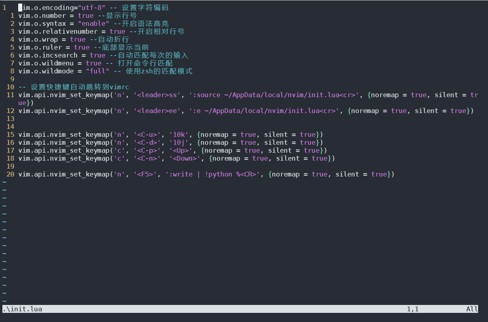
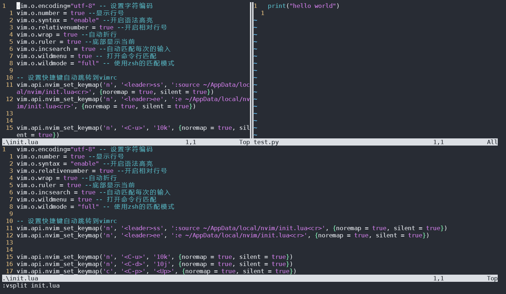
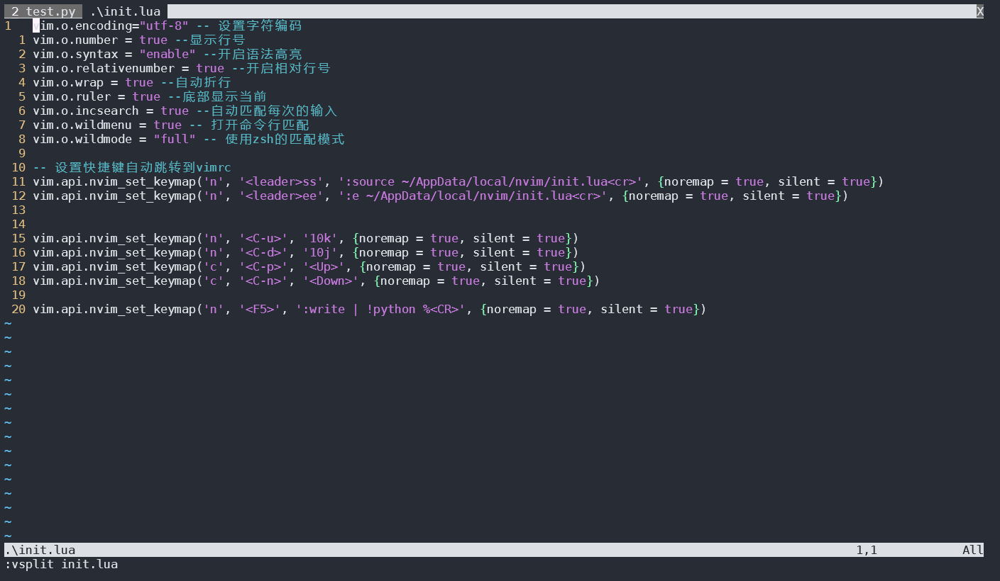

# vim 从嫌弃到依赖(11)——标签页操作

各位小伙伴们，你们好，我又更新了！
之前介绍了vim关于多窗口的操作，vim中多窗口是将多个窗口在一个屏幕中显示，这似乎与我们常见的ide有点不一样，一般的ide都是新开一个窗口之后在新的标签页中显示，通过不同的标签页对应不同的文件。我们的浏览器就是一个典型的例子。

而vim似乎不是这样的，vim管理文件采用的是缓冲区列表的方式，一个缓冲区对应一个显示窗口，而多个窗口可以显示在一个屏幕上。而vim中的标签页更像是一个容器，用来容纳这么些窗口。它更像是一个虚拟桌面，不管在功能上还是使用习惯上都像是虚拟桌面。（虚拟桌面可是个摸鱼的好东西，不过现在有更高级的摸鱼方法就是了。 有朝一日我一定要尝试用vim来摸鱼）

除了使用它来摸鱼，我们再来想象这么一个场景：我们在做一个项目，已经打开了需要的代码文件，并且将它们经过了精心的布局，但是这个时候来了新的任务（以前的老项目出bug了，wtf！），我们不想在精心布置的窗口中插入这么一个第三者，总归心里有点别扭。这个时候我们新开一个标签页，在这个标签页里打开原来项目相关的文件。当我们修复完这个bug之后，直接切回到原来的标签页。之前的布局仍在原地等待着你（这么一个对你不离不弃的编辑器，多么令人感动）。

我知道，看了我这么长的vim教程，很多小伙伴已经头晕脑胀了，甚至有的可能觉得最近介绍的东西，使用插件能更好的完成类似的操作，这些操作方式已经过时了。但是vim它提供了原生的操作，总有它的道理。打起精神来吧。

## 标签页

可以使用命令 `:tabedit {filename}` 打开一个新的标签页，如果不加文件名则打开一个空的标签页。我们也可以使用 `tabnew` 命令，参数与效果完全相同。

&#x20;

<figure><figcaption></figcaption></figure>

如果当前标签页中包括多个窗口，那么可以使用 `<Ctrl+w>T` 将当前缓冲区移动到新的标签页中。

&#x20;

<figure><figcaption></figcaption></figure>

### 关闭标签

可以使用 `tabc[lose]` 或者使用 `tabo[nly]` 来关闭标签页，前者是关闭当前标签页，后者是关闭所有，只保留当前激活的标签页。

### 切换标签页

在普通模式下使用 `gt` 切换到下一个标签页，使用 `gT` 切换到上一个标签页，也可以在命令模式中使用 `:tabn[ext]` 和 `tabp[revious]` 来达到同样的效果。另外 `tabnext` 和 `gt` 前面都是支持添加数字编号的。这样我们可以方便的跳转到第几个标签页，这个编号是从1开始的。

&#x20;

<figure><figcaption></figcaption></figure>

&#x20;

<figure><figcaption></figcaption></figure>

最后再介绍一个 `tabmove {n}` 命令，它可以用来移动当前标签页到指定位置，后面加数字表示移动到第几个标签的位置，不加数字默认移动到结尾位置。当然如果你使用的是图形版的vim或者终端支持鼠标操作，也可以使用拖拽的方式完成这一工作。

&#x20;

<figure><figcaption></figcaption></figure>
## 最后总结

关于标签的操作，基本就这么多了。其实真要说起来，这些操作比较繁琐，记起来也麻烦，vim自带的标签功能相对比较简陋，后面我会介绍对应的插件对其进行扩充，本来我想跳过这部分的内容，毕竟有更好的插件和更好的操作方式。但是它作为vim提供的一大功能，使用频率也算比较大，想想还是说一下比较好吧。

最后总结一下提到的一些命令吧：

- `:tabedit {filename}` : 新建标签页，并在标签页中打开对应文件
- `tabnew`: 与 `tabedit` 完全相同
- `<Ctrl+w>T`: 如果当前标签中有多个子窗口，它会将当前活动子窗口放到新的标签页中
- `tabc[lose]`: 关闭当前标签页
- `tabo[nly]`: 关闭除当前激活标签页的所有
- `gt` 或 `:tabn[ext]`: 切换到下一个标签页
- `gT` 或 `tabp[revious]`: 切换到上一个标签页
- `tabmove {n}`: 移动当前标签页
