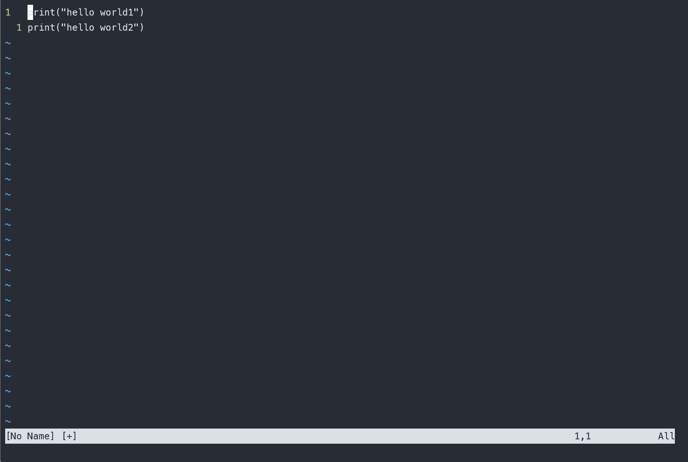
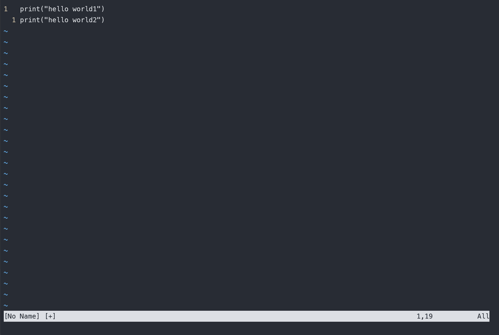
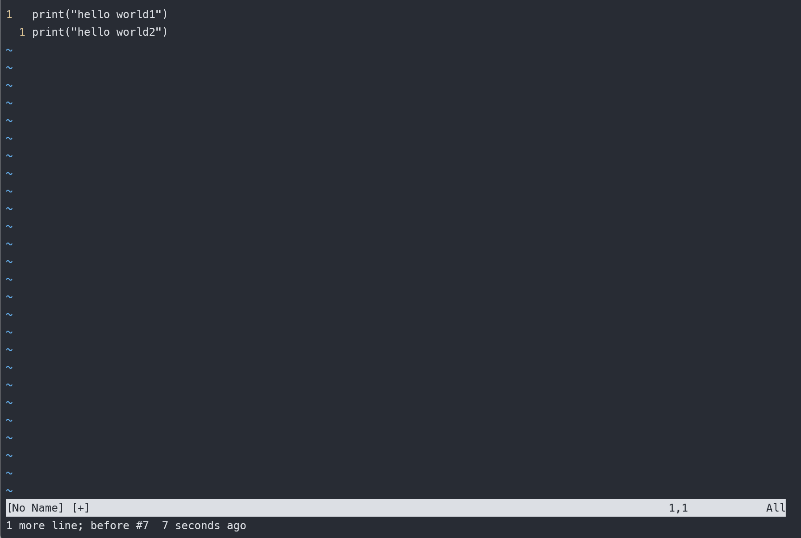
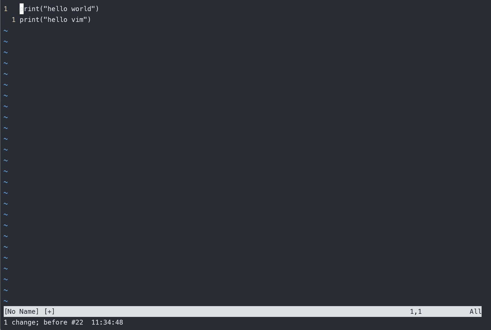

# vim 从嫌弃到依赖(15)——寄存器

在计算机里面也有寄存器，计算机中的寄存器是看得见，摸得着的实体，寄存器中存储需要经常访问的一些数据。而vim中也有寄存器的概念，vim中的寄存器是一个虚拟的概念，更像是一块专门用来存储数据的内存缓冲区。在使用vim的过程中离不开寄存器，而且我们很早就用到了寄存器，只是没有发现罢了。这篇文章将深入介绍寄存器，这样我们对之前使用的命令将会有更深的认识。

## 几种寄存器类型

## 无名寄存器

在之前介绍过，可以使用 `d`来删除一段内容，使用 `p`来粘贴，使用 `y`来复制， vim中其他的带有删除功能的 `operator` 像 `x`、`c`、`s` 之类的，vim在删除之前会将被删除内容先放到无名寄存器中，然后执行删除操作。严格意义上来说，他们并不是删除而是剪切。后续可以通过 `p` 命令来粘贴之前被删除的内容
例如

```python
print("hello world")
print("")
```

改为

```python
print("")
print("hello world")
```

就可以在第一行通过di"，将被删除的内容存储到无名寄存器中，然后在第二行对应位置执行 `p` (或者 `P`) 命令取出无名寄存器中的内容。
&#x20;

<figure><figcaption></figcaption></figure>

这里在使用 `h` 移动光标之后，光标所在位置在后一个引号的位置，为了减少一次光标移动，我直接使用 `P` 在光标所在位置之前进行粘贴操作。

这里插一个题外话，vim中的命令都是某些有意义的单词的首字母或者几个字母的缩写，像 `d`代表delete、`y`代表 `yank`，那么 `p`又代表什么呢，粘贴的英文是 `paste`，但是知道寄存器以及复制粘贴在vim的表现，我觉得应该是 `put`，就是将寄存器中的内存拿出来。好在他们的首字母相同，不影响记忆。

## 有名寄存器

它是对应无名寄存器来说的，无名寄存器虽然说使用方便，但是有一个很大的问题，那就是如果我们连续两次执行了删除或者复制操作，那么前一次保存的内容将会被后一次的给覆盖掉。为了解决这个问题，一个思路就是使用有名寄存器。
vim中提供了由a到z的有名寄存器，可以在使用 `operator` 的操作前面指定需要使用的寄存器，引用一个寄存器可以使用 `" + 寄存器名`的格式。这个时候我们之前的公式就又可以扩展了

```text
" + regester + operator + motion
```

例如在执行删除的时候 `"add` 将一行删除的内容放到a寄存器中，再次执行 `"bdd`将内容放到b寄存器中，执行粘贴的时候，可以使用 `"ap`和 `"bp`来分别使用 a和b寄存器的内容。
&#x20;

<figure><figcaption></figcaption></figure>

无名寄存器有一个专用的符号，使用 `"`来表示。也就是说 `dd` 命令其实等效为 `""dd`。但是为了偷懒和方便，还是少输几个字符的好。

## 复制寄存器

前面说到使用 `dd` 之类的命令会将被删除的内容放到无名的寄存器中，它的行为有点像普通编辑器中的剪切，那它是不是剪切呢，那么多教程都把它叫做删除，是不是有问题呢。它确实是删除指定，教程说的也没错，vim中有专门存储复制内容的寄存器。普通的删除命令会把被删除的内容保存到无名寄存器中，但是这些内容不会被保存到复制寄存器中。复制寄存器使用 0来表示。即我们可以使用 "0p来将复制寄存器的内容取出。也可以通过命令 :reg 0来查看这个寄存器的内容。
&#x20;

<figure><figcaption></figcaption></figure>

在上述例子中，我们先在第一行执行 `yy` 操作进行复制，这个时候数据会被同时保存到无名寄存器和复制寄存器。然后在第二行执行 `dd` 删除，这个时候第二行的数据会被保存到无名寄存器，之前保存的第一行的数据就被删除了，但是不会被保存到复制寄存器，第一行的数据仍然存储在赋值寄存器。接着立即执行 `p` 它会从无名寄存器中中取出我们之前删除的第二行的数据。接着再执行 `"0p` 会从复制寄存器中取数据，这个时候取出的仍然是第一行的数据。

## 黑洞寄存器

前面说到 dd会将被删除内容放入到无名寄存器中，如果这段内容我确实不想要了，也不想它占用寄存器，有没有什么办法彻底删除呢，答案是使用黑洞寄存器，顾名思义，放入该寄存器中的内容都被吸走丢失了，无法使用了。黑洞寄存器使用 _作为标识符，执行删除指令的时候可以使用 "_dd这样就再也访问不到之前删除的内容了。
&#x20;

<figure><figcaption></figcaption></figure>

在上面的例子中，我们先执行普通的 `dd` 命令，它会将删除内容放入到无名寄存器中，第二次执行的是 `"_dd` ，它会将内容放到黑洞寄存器中直接丢弃，后面执行 `p` 的时候只会粘贴第一次删除的内容。有小伙伴可能会说，这个跟我使用其他有名寄存器效果是一样的。看不出什么区别，那么我们可以试试使用 `:reg` 命令来查看有名寄存器和黑洞寄存器的值，我们发现黑洞寄存器的值永远为空，而有名寄存器此时多了一条记录。

## 系统剪切板

之前我们在vim中复制粘贴的内容，只能在vim中使用。同样的系统中复制粘贴的内容只能在系统其它程序中使用，无法直接粘贴到vim中。我们可以在vim中使用系统剪切板。vim可以使用 `+`来访问系统剪切板。例如使用 `"+yy`将内容复制到系统剪切板中，供其他程序使用。

但是在有好的shell工具的加持下，我更喜欢用 `<Ctrl+v>`这样的方式直接粘贴一大段文字到vim中。或者配合vim的可视模式，直接使用shell中的快捷键从vim中粘贴选中的内容到系统剪切板

## 表达式寄存器

前面介绍的几种寄存器都是被动的存储静态的内容，只有存储功能。表达式寄存器则可以接受一段vim脚本并执行它并输出结果。表达式寄存器使用 `=`来表示。
例如在插入模式中可以使用 `<Ctrl+r>=6*6` 来进行数学计算并输出。
&#x20;

<figure><figcaption></figcaption></figure>

到此已经介绍完了vim中几种主要的寄存器，是不是觉得挺抽象的，而且用起来也不是那么方便。下面我们还是以例子来展示相关用法。

# 示例

## 示例1：复制粘贴的使用

假设我们要将如下代码

```python
print("hello world")
print("hello vim")
```

修改为

```python
print("hello world")
print("hello world")
```

可以在第一行使用 `yi"`来复制引号内的内容，但是如果在第二行先使用 `ci"`再使用 `p`进行粘贴的话会发现粘贴的仍然是 `hello vim`这是因为后面使用 `c`操作的时候，已经将原来的给覆盖掉了。现在我们来解决这个问题。

第一种解法：`y`指令可以额外产生一个动作，它会将内容放入到复制寄存器中，那么在执行了ci"之后使用 "0p来使用复制寄存器中的内容
&#x20;

<figure><figcaption></figcaption></figure>

第二种解法：可以手动指定ci"删除的内容放入到黑洞寄存器中，即执行"_ci"这样就不会产生覆盖问题。
&#x20;

<figure><figcaption></figcaption></figure>

前两种方法虽然解决问题了，但是都引入了新的寄存器，按键比较繁琐，如果不想引入新寄存器，就得使用接下来介绍的第三种方法了，它也是我最喜欢的方法了。

解法三：由于我们需要先删除之前的内容再复制，为了快速删除，所以会发生覆盖问题，我们只要不执行删除操作就不会覆盖了，为了一次性完成粘贴替换的操作，可以使用选择模式，之前介绍选择模式的时候说过，在选择模式下 `operator` 会将选中部分作为操作区域。可以使用 `vi"` 来选中引号内容，然后直接使用 `p` 完成复制

&#x20;

<figure><figcaption></figcaption></figure>

## 示例2：插入模式中使用寄存器

之前已经在介绍表达式寄存器的时候已经介绍了如何在插入模式中使用寄存器，可以使用 `<Ctrl + r> + register` 例如上面的例子可以使用 `<Ctrl + r>0`来将复制寄存器中的内容写入到光标所在位置。
&#x20;

<figure><figcaption></figcaption></figure>

相比上面介绍的前两种解法，它省去了切换回普通模式的步骤，相对来说更高效一点。但是我觉得它还是比不上第三种解法。

## 示例三： 处理粘贴混乱的问题

有的时候在粘贴代码的时候发现代码的格式可能会乱，这个时候可以设置 `:set paste`选项，设置之后复制粘贴将不再出现这个问题，但是它会使我们在其他模式下设置的快捷键失效，在粘贴完了之后可以使用 `:set nopaste`取消该设置。由于我使用的 `neovim`中没有发现这个问题，就不演示了，各位使用 `vim`的小伙伴可以自行测试。

当然处理该问题的另一种方式是使用之前介绍的在 `vim`中使用剪切板的方法，也就是使用 "+p这样的形式。
