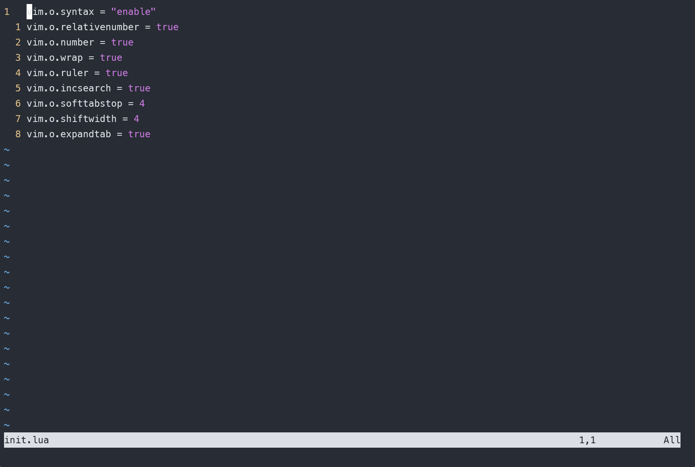
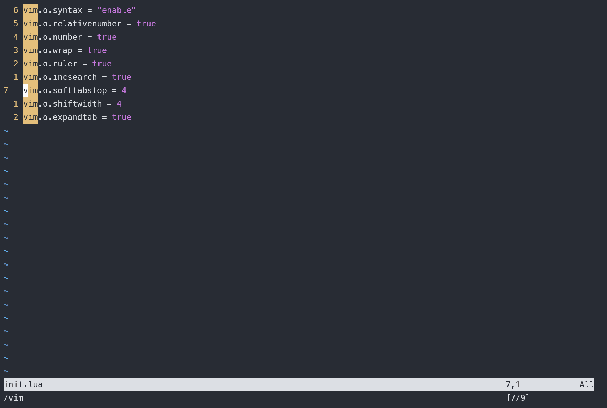
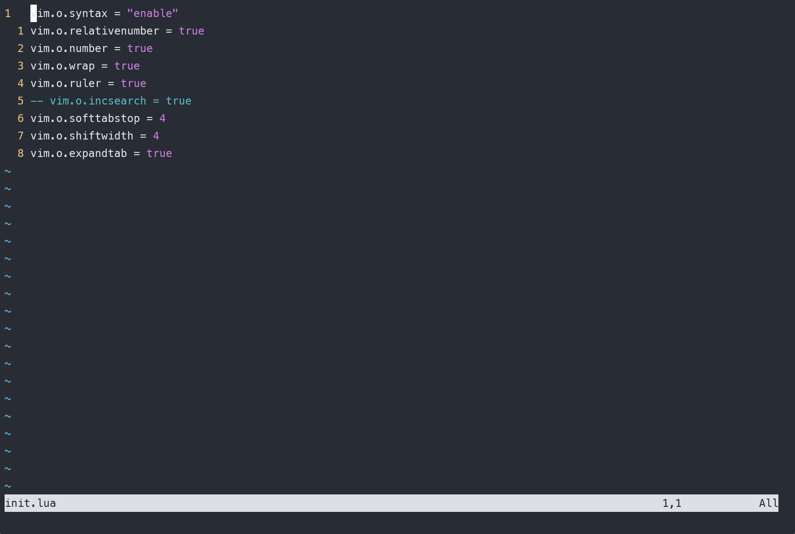
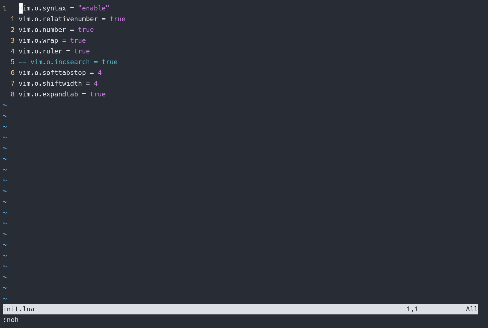

# vim 从嫌弃到依赖(17)——查找模式

最开始介绍vim的时候，提到vim有普通模式、插入模式、可视模式和命令行模式，并且已经对这几个模式做了详细的介绍了。除了这几个模式以外，vim还有一个非常强大的模式——查找模式，为什么最开始没有将其列举出来呢，这是因为我很少看到有教程将它与前面介绍的模式并列作为一个新的模式。但是在日常使用中，我又习惯将它叫做查找模式。我在这里就不深究这些了，请读者自行判断。

## 插入模式使用

我们可以在普通模式下输入 `/` 进入插入模式。在其后面输入想要查找的字符串，按下 `<CR>` 进行查找。此时vim光标会自动跳转到匹配的位置，并将对应位置高亮显示( 这个是 `neovim`的特性，vim高亮可能需要一些配置)。使用 `<Esc>` 将会结束查找，退回到普通模式。

在匹配模式中，可以使用 `n` 来跳转到下一个匹配位置，按下 `N` 将跳转到上一个匹配位置。这个查找是循环进行的，也就说在跳转到最后一个匹配位置之后，再使用 `n` 将会跳转到第一个匹配位置。
&#x20;

<figure><figcaption></figcaption></figure>

我们可以使用 `wrapscan` 这个选项关闭这一特性，例如在 `neovim` 中使用如下代码

```lua
vim.o.wrapscan = false
```

或者在vim中使用这样的代码

```vimrc
set nowrapscan
```

在查找模式中，可以使用 `<UP>` (也就是方向键) 来遍历之前查找项。

## 取消高亮的匹配

vim 中可以使用 `hlsearch` 来设置将匹配项进行高亮显示( `neovim` 则默认支持该项) 。高亮显示匹配项这个特征在我们寻找这些匹配项的位置时十分有用，但是一旦找到想去的地方之后，这些高亮显示的内容却会干扰我们的视线，特别是匹配项过多的时候。这个时候我们可以使用 `noh` 来取消高亮。但是每次这么输入比较麻烦，我们可以绑定一个快捷键，快速取消高亮。这里还是等到介绍配置的时候再介绍吧。
&#x20;

<figure><figcaption></figcaption></figure>

## 执行前预览第一处匹配

在一般的vim中，一定要等到输入完完整的内容，然后按下 `<CR>` 键之后才会进行匹配，而执行前预览会在每次有新输入的时候更新匹配。类似于下面的效果。
&#x20;

<figure><figcaption></figcaption></figure>

输入 `s` 的时候，所有 `s` 字符都被选中，输入后面的内容时再次匹配，只高亮匹配上的。

vim模式并未开启这个效果，可以使用 `incsearch` 来激活这一效果。而neovim则默认支持这一选项。

## 快速选中光标所在单词进行搜索

这里主要为了介绍 *这个命令，当光标处于目标单词的时候，按下 `*` 将直接进行搜索。
&#x20;

<figure><figcaption></figcaption></figure>

## 将光标移动到匹配的结尾

默认情况下，使用匹配模式时，光标都在匹配字符串的开头位置，我们可以在搜索结尾处添加 `/e` 来让vim将光标移动到匹配字符串的结尾处
&#x20;

<figure><figcaption></figcaption></figure>

相信通过这篇文章各位小伙伴已经初步了解了如何进行查找，但这些内容是远远不够的，vim提供了强大的搜索处理能力，在下一篇我们将慢慢展开介绍。
