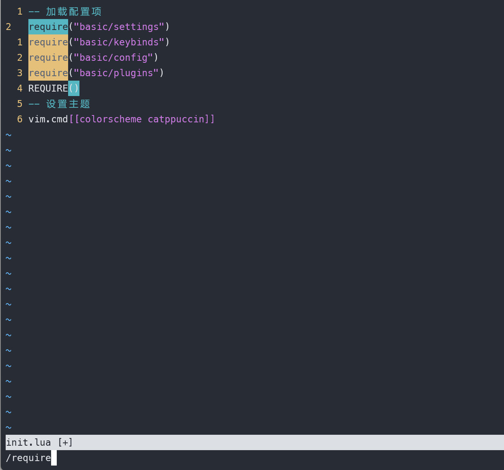
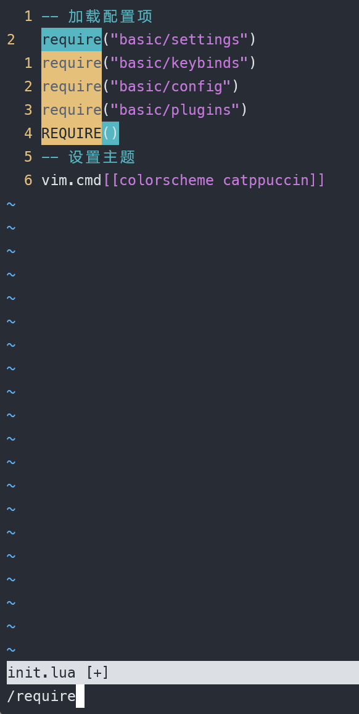
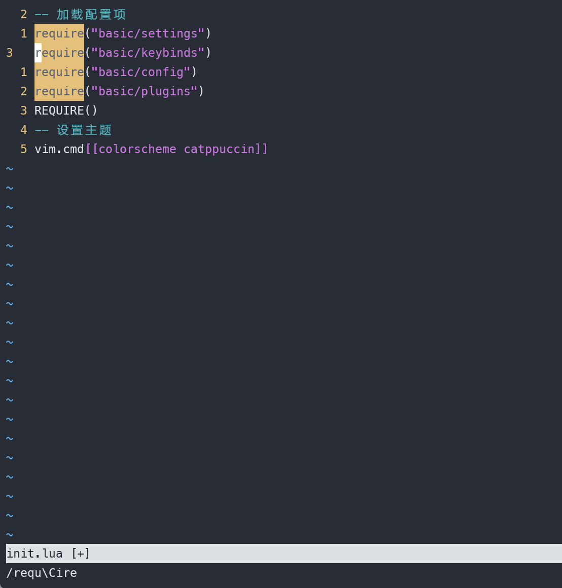
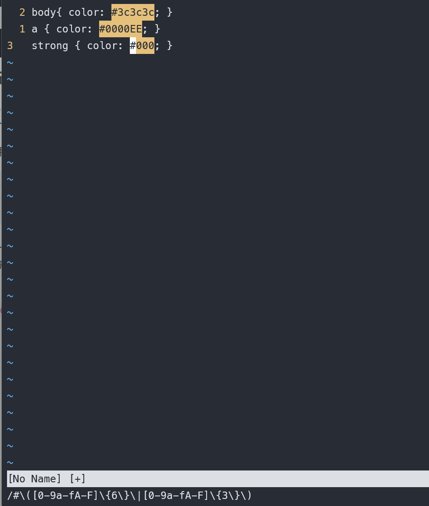
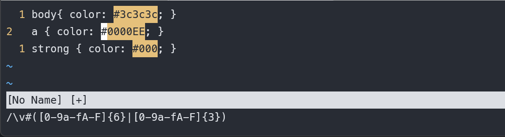
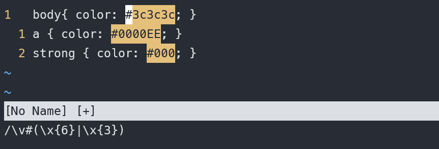
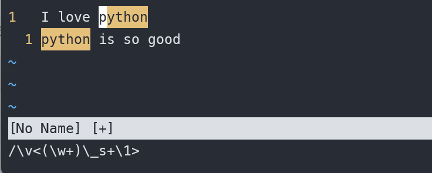
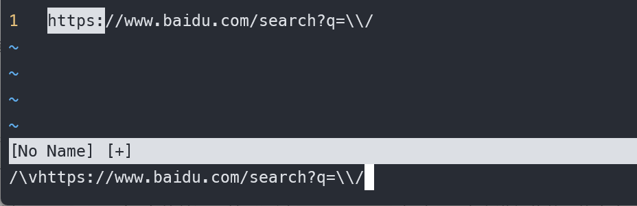
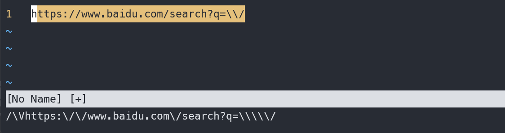

# vim 从嫌弃到依赖(18)——查找模式进阶

上一篇文章中，我们初步结识了如何使用查找模式，也能够通过n和 N进行查找。这篇将会介绍搜索中更高级的用法。另外在写上一篇文章的时候我发现介绍查找相关内容的时候不能用动图来演示，主要是因为输入的内容太多了，剪成动图的话太大了，不一定能上传。第二个就是开启了匹配高亮的选项，比起动图来能更直观的看到匹配的结果。所以这篇文章就不采用动图了。

## 调整大小写敏感

默认情况下，在搜索时是大小写敏感的，例如下面的例子中，我们无法匹配到大写的REQUIRE的

&#x20;

<figure><figcaption></figcaption></figure>

可以使用 `ignorecase` 项来取消大小写敏感，例如在 `neovim` 中写上如下配置

```lua
vim.o.ignorecase = true
```

或者在 `vim` 的配置文件中写上

```vim
set ignorecase
```

此时在输入 `require` 时，发现已经可以匹配到 `REQUIRE` 了
&#x20;

<figure><figcaption></figcaption></figure>

但是在实际使用中我们希望有时候大小写敏感，有时候大小写不敏感，例如想模糊搜索某个函数或者变量的时候。更好的做法是设置 `smartcase` 项。它只有在输入的字符中有大写才启用大小写敏感，否则就是大小写不敏感。

```lua
vim.o.smartcase = true
```

```vimscript
set smartcase
```

当然我们也可以在每次搜索的时候单独指定本次搜索是否大小写敏感。可以在匹配时输入\c来不区分大小写而使用 \C区分大小写，这个符号可以出现在任何位置，哪怕你输入 /requ\Cire它也能正确找到所有的 require字符串。
&#x20;

<figure><figcaption></figcaption></figure>

## 使用正则表达式匹配

vim支持正则表达式的搜索，vim采用的是 POXIS的正则表达式的规则，这就让我们一些习惯 Perl正则表达式规则的人在使用时会出现一些不适宜。现在我们来看一个具体的例子

假设现在有一个 css 文件, 我需要搜索里面的16进制颜色

```css
body { color: #3c3c3c; } 
a { color: #0000EE; } 
strong { color: #000; }
```

我们在搜索时输入这样一个正则表达式 `#([0-9a-fA-F]{6}|[0-9a-fA-F]{3})` 。发现它会报错，但是正则表达式来看，这么写是没问题的，我们要匹配的是以 `#` 开头，后面有6个或者3个16进制数的字符。

这是因为里面有特殊字符，需要进行转义，例如 `()` 在 vim 中有特殊用途,我们将在接下来介绍它的用途。我们需要将正则表达式写成这样 `#\([0-9a-fA-F]\{6\}\|[0-9a-fA-F]\{3\}\)`
&#x20;

<figure><figcaption></figcaption></figure>

好家伙，反斜杠居然有7个，而且 `()`、`{}` 需要转义，而 `[]` 不需要转义。正则表达式就够麻烦的了，还得记住vim与其他编辑器的不同，用一次人就麻了。

好在vim提供了 `very magic` 模式，即除了 `_` 、 数字、字母之外的所有字符都具有特殊含义，这样我们就不用纠结哪些需要转义，哪些不需要了。可以在搜索的开头添加 `\v` 来启用这一模式，即我们可以输入 `\v#([0-9a-fA-F]{6}|[0-9a-fA-F]{3})`
&#x20;

<figure><figcaption></figcaption></figure>

我们还可以使用 `\x` 表示16进制数，以便简化上述正则表达式, `\v#(\x{6}|\x{3})`。
&#x20;

<figure><figcaption></figcaption></figure>

`\x` 是vim 字符类中的一个成员，我认为比较有用的还有如下这些

| 字符 | 含义                  |
| :--- | :-------------------- |
| \x   | 十六进制数            |
| \X   | 非十六进制数          |
| \d   | 数字                  |
| \D   | 非数字                |
| \o   | 八进制数              |
| \o   | 非八进制数            |
| \w   | 包括字母、数字和 _    |
| \W   | 不包括 字母、数字和 _ |
| \h   | 包括 字母和 _         |
| \H   | 不包括字母和 _        |
| \l   | 小写字母              |
| \L   | 非小写字母            |
| \u   | 大写字母              |
| \U   | 非大写字母            |

除了有 `very magic`模式，vim 中还有 `very nomagic` 模式，在该模式中所有的字符都只表示它自身，没有特殊含义，例如 `.` 在正则表达中表示单个字符，但是在 `very nomagic` 模式中它就表示一个点，它可以匹配点这个字符本身，要启用 `very nomagic` 模式，可以使用 `\V` 作为前缀。

## 使用括号获取子匹配项

在 vim 中可以使用 `<(\w+)\_s+\1>` 来匹配重复单词，例如

```text
I love python
python is so good
```

这句话中我们可以匹配到 `python` 这个单词。
&#x20;

<figure><figcaption></figcaption></figure>

我们来看这个正则表达式，`<>` 匹配以某些字符开头或者结尾的单词，例如 `<Py` 将匹配所有以 `Py` 开头的单词，而 `on>` 将匹配所有以 `on` 结尾的单词，因为这里我们的需求并没有要求要匹配以某些字符开头的单词，加上这个就限定我们要匹配单词而不是某些个字符。`\_` 后面可以加vim字符类中的任意字符，代表在原来的基础之上额外再匹配换行符，例如 `\x` 可以匹配16进制数，`\_x` 可以匹配16进制数和换行符。`\_s+`就是匹配 `<Tab>` 空白字符和换行符，并且是匹配1个或者多个。

在vim中使用括号代表子匹配项，它是整个正则表达式匹配的一个子项，例如 `Py(tho)n` 它可以匹配到 `Python` 和 `Python` 字符串里面的 `tho`。\后面加数字代表第几个匹配项，第0个匹配项是整个正则表达式的匹配项，1、2、3、....、n 则对应着第1个子匹配项，第二个、第n个子匹配项。

了解了这些，我们就能读懂整个这个正则表达了，它匹配这样一个单词：他是任意单词，但是它后面需要出现一个跟他一样的单词，不管中间包含的是多个空格、制表符或者换行符。

如果我们只是想匹配是否有多个重复的 Python可以这样写： `(<Py\w+on>)\_s+\1`

## 界定匹配范围

在搜索模式中，vim把查找域中输入的内容（可以是正则表达或者是原意匹配的字符串）和它匹配的到的高亮的文本进行了区分。一般将查找域中的内容称之为模式，将被高亮显示的文本称之为匹配。一个模式可以对应多个匹配（这里的模式与前面提到的普通模式和插入模式的意思不同）。

一个匹配的边界通常对应着一个模式的起始与结尾。例如 `<>` 表示一个匹配的边界将是一个单词。除了这个，vim提供了 `\zs` 和 `\ze` 这两个元字符来对一个匹配进行裁剪。`\zs` 表示去掉匹配中开头的指定部分、`\ze` 表示去掉匹配中结尾的指定部分。

例如在上面这句话中，我通过 `<\w+>` 匹配到所有的单词。然后通过 `<\zsPy\w+>` 来对匹配内容进行裁剪，将高亮显示所有单词 `Py` 以及后面的内容，如果不是以 `Py` 开头的则完全被裁剪掉了。或者使用 `<\w+\zeon>` 来裁剪，只显示所有单词 `on` 前面的部分。

## 转义特殊字符

这里我们用一个URL 作为例子来演示

```text
https://www.baidu.com/search?q=\\/
```

假设我们要匹配所有文档中出现的这个url，该如何做呢？

首先考虑在匹配模式中输入一大串的内容，但是这一大串不需要手工输入。我们可以将vim的命令模式和现在的匹配模式看成一个特殊的插入模式中的文本，这样我们就可以使用前面介绍的在输入模式中使用寄存器的例子。先使用 `"iy$` 粘贴一行，然后在匹配模式中使用 `<Ctrl+r>i` 来粘贴。
&#x20;

<figure><figcaption></figcaption></figure>

但是这个时候我们发现匹配的结果并不是我们想要的，这是因为在匹配模式中 `/` 是具有特殊意义的特殊字符，我们需要告诉vim将其解释为普通字符，这个时候可以使用 `\V` 来进入 `very nomagic` 模式，该模式与 `very magic` 相反，将所有字符作为普通字符来解释。

我们会返现它只匹配到了 `https:`，并且模式中的字符串也变成了 `https:` , 后面从/开始截断了，这时候我们可以使用 `\/` 对 `//` 进行转换。同时 `\` 本身也作为特殊字符，我们也需要对其进行转义。即整个匹配应该输入 `https:\/\/www.baidu.com\/search?q=\\\\\/`
&#x20;

<figure><figcaption></figcaption></figure>

本篇中主要讲述了如何在vim中使用正则表达式，到此应该已经聊完了vim中查找模式中的基本操作了。后面我们将介绍该如何进行替换操作。
