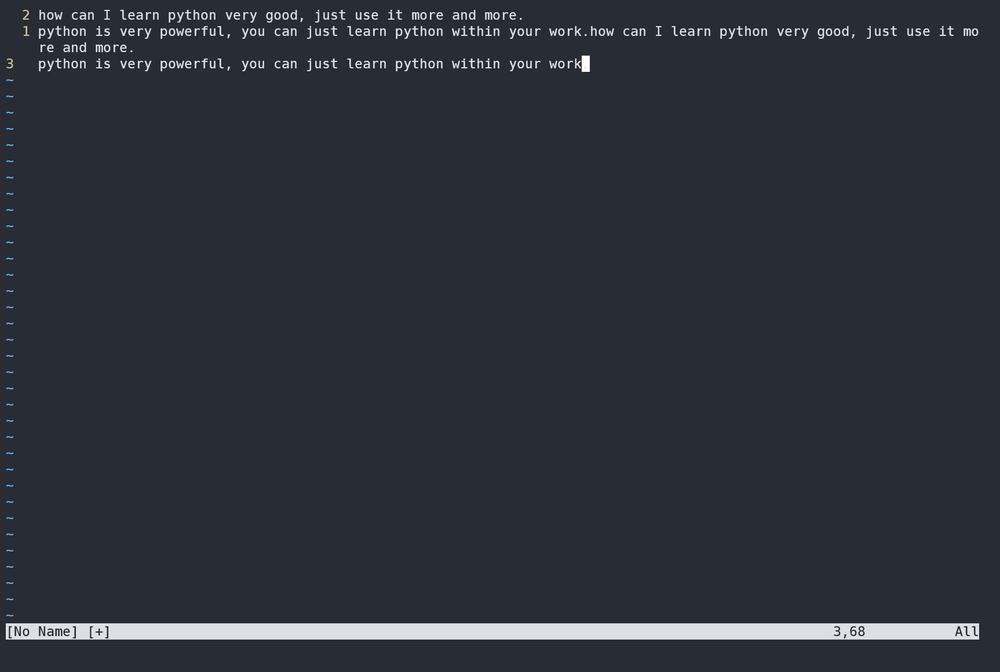

# vim 从嫌弃到依赖(19)——替换

之前讨论了关于在vim中使用正则表达式的相关知识能方便的进行搜索，现在在之前的基础之上继续来讨论如何进行替换操作。

## substitute 简介

substitute 允许我们先查找一段文本并用新的文本将匹配上的文本进行替换。它的使用比较复杂，需要提供一个匹配模式和一个替换的字符串。命令格式如下：

```vimscript
:[range]s[ubstitute]/{pattern}/{string}/{flag}
```

- range 表示范围，与之前介绍的其他 ex 命令中范围的作用一样。
- pattern 表示一个匹配模式，回忆一下之前说过的，这里的模式跟之前介绍的普通模式、插入模式的含义不同，它代表的是一串用来进行匹配并高亮显示的字符串。
- string是一串用来进行替换的字符串，将匹配项都替换成某项。
- flag是一些替换的标志，我们将在后面的内容中进行介绍。

例如 `:%s/python/Python/g` 表示在整个文件中将 python都替换为 `Python`（这么长时间没怎么提到 ex 命令了，不知道各位小伙伴是否还记得 `%`代表当前打开的文件）。`g` 是一个标志位，表示修改整行中的所有匹配项，而不仅仅是修改第一个匹配项。

## 标志位

上面的例子中我们使用了一个 `g` 作为标志位，其实还有其他的标志位。我们可以通过标志位灵活的定义 `substitute` 的行为。下面是一些常用的标志位：

- `\r`：插入一个换行符
- `\t`：插入一个制表符
- `\\`：插入一个反斜杠
- `\1`：插入第一个子匹配项
- `\2`：插入第二个子匹配项
- `\0`：插入匹配模式的所有内容
- `&`：与 \0用法相同
- `~`：使用上一次调用 substitute时提供的 string内容
- `\={vim script}`：执行 vim script并将返回内容作为 string

有这么多标志位，该怎么记，平时怎么用到呢？别急，下面将通过相应的示例来演示如何使用它们，我们完全可以在日常使用中学会它们。

## 示例

### 使用 `g` 替换所有内容

```text
how can I learn python very good, just use it more and more.
python is very powerful, you can just learn python within your work.
```

我们将上面文本中的所有 `python` 都改为 `vim` 。我们先来看看不使用标志是什么样子的。即这里输入 `:%s/python/vim`
&#x20;

<figure><figcaption></figcaption></figure>

我们发现它只替换了每一行的第一个出现 `python` 的地方，同一行后面的 `python` 不受影响。这里我们使用 `/g` 替换每一处出现 `python` 的地方。

&#x20;

<figure><figcaption></figcaption></figure>

`g` 这个标志很容易联想到 `global` 这个单词，应该表示的是整个选中的文本范围，而我们前面已经选定了当前文件中的所有文本，似乎看起来很合理。但是 `g` 作用范围应该是整行，而我们选中的是文本中的所有行。看起来效果是一样，但是理解起来确实有差距。为什么它会作用于行，我想应该是 `vim` 发源于 `ed` 这个编辑器，vim的 `ex` 命令起源于 `ed` 编辑器，而后者是一个行编辑器，所以大部分的命令都作用于行。这样应该就能说得通了。

### 手动选择是否需要替换

有的时候我们并不希望盲目的对所有内容进行替换，而只替换其中的部分内容。例如上述的文本中，我们只想替换第二行的最后一个 `python` 为 `vim`。那么可以使用 `c` 标志。你可以理解为 `copy ?`。vim会询问我们是否需要进行替换。即我们在这里输入 `:%s/python/vim/gc`。后面可以按下 `y` 来确定替换，`n` 表示不进行替换并切换到下一处匹配。因此这里我们可以输入 `nny`
&#x20;

<figure><figcaption></figcaption></figure>

其实不光yn这两个选项，从vim的提示看总共有 ynaql和 <Ctrl +e>以及 <Ctrl + y>。它们的含义如下：

- y：替换本处匹配
- n：不替换本处匹配
- a：替换此处之后的所有匹配项，随后退出本次替换
- q：退出本次匹配
- l：替换此处之后退出本次替换
- <Ctrl + e>：向上翻滚屏幕
- <Ctrl + y>：向下翻滚屏幕

### 重用上次匹配模式

如果我们将 `{pattern}` 部分留空，那么 vim会重用上次的 `{pattern}` 。下面我们使用一个例子来看如何使用这一特性。

```c++
#define VERSION "v1.01"
#define TITLE "vim"
#define PATH "~/.config/nvim"
```

我们想将里面的字符串改为宽字符，也就是在双引号前加L我们首先要匹配所有的引号内容。很多时候正则表达式比较复杂，无法一次就写对的，所以这里我们分步骤来，首先正确写出正则表达式匹配出所有带双引号的字符串。 \v\"(.*)\"可以获取所有的字符串。
&#x20;

<figure><figcaption></figcaption></figure>

接着我们使用上面的这个模式来进行替换，即输入 :%s//L\0/gc。当然这里只有这么三行一眼就知道我们要替换所有，但是代码一长了，就需要我们来确认是否需要替换。
&#x20;

<figure><figcaption></figcaption></figure>

复杂的正则表达式我们无法一次就输对，如果进行替换操作的时候因为正则表达式输入不对导致每次都得重新输入一堆内容就显得比较麻烦了。而且如果使用 `substitute` 命令之后才发现错了，又得撤销重新输入那么大一串。与 `substitute` 相比，查找模式不会修改文本，我们可以在查找模式中使用 `<Up>` 慢慢修改直到满意为止。当模式对了，下面就可以利用 `{pattern}` 留空这种方式来重用上次模式。

需要注意的是将模式留空，将会在历史命令中留下一个不完整的记录，模式与命令是独立存储的。在上面的例子中，如果我又执行了新的匹配，例如我想查找所有 `define`，后面使用 `<Up>`重新执行命令的时候，发现匹配的内容变了。有一个办法就是将上次的模式存储到寄存器中，在匹配的时候从寄存器中取数据填充 `{pattern}` 部分。

上次匹配成功之后如何将对应的模式放到寄存器呢，这里我们介绍一个新的内容——命令窗口。命令窗口是一个显示历史命令的缓冲区，它跟普通的缓冲区区别仅仅在于它显示的是历史命令而已。使用 `q:` 可以调出，这里我们可以使用 `q/` 调出模式的命令窗口。在对应模式行使用 `"iy$` 来粘贴一行，然后在最后替换时使用 `<C-r>i` 来填充 `{pattern}`。
&#x20;

<figure><figcaption></figcaption></figure>

&#x20;

<figure><figcaption></figcaption></figure>

使用留空这一招有时候很方便有时候又很麻烦，上述两种方式具体如何使用请各位结合具体情况自行判断吧。

### 使用寄存器的内容进行替换

`{pattern}` 域留空了，vim会自动以上一次的模式来进行匹配，那么如果我把替换域留空，是不是会以上次替换的字符串作为这次的进行替换呢？试验过后发现 `vim` 并不会这样做，它会使用空字符串进行替换（单纯的使用上次的替换字符串使用的是 `~` 这个符号）。如果想要快速填充替换域，可以先进行复制，然后在 `substitute` 中使用 `0` 寄存器。即，我们可以输入 `:%s/{pattern}/<C-r>0/gc` 来完成替换。就想上面的例子那样。

但是这种方式有一种缺陷，那就是如果复制的内容中有 `/ &` 之类的特殊符号的话，它会出现错误。这个时候我们可以手动编辑寄存器中的内容，对特殊符号进行转义。这个时候我们会想有没有什么办法能让vim知道我只想将寄存器中的特殊符号作为普通字符串呢？当然是有办法的，我们可以借助 `vim script ` 来实现这一需求。我们可以输入 `:%s/{pattern}/\=@0/gc`，其中 `\=`是我们之前列举的使用 `vim script`，而后面的 `@0` 则是 `vim script` 的内容，表示取 `0` 寄存器的内容。

这里出现了 vim script的内容，不过不用担心，这里涉及到的都是最简单的vim script内容，而且更新完了 vim 的基础内容之后会开一个新专栏介绍vim script和vim的配置，那个时候再回过来看这个方法也可以。这段脚本也很容易理解是不是？

### 使用上一次的 `substitute` 命令

假设我们在执行 substitute命令的时候忘记了在前面添加 %，我们当然可以使用 `<Up>` 键来在上一次的基础之上进行修改。

这里介绍一个更简单的方式，可以在普通模式中输入 `g&` 它会在整个文件中重新执行上一条 substitute命令。它等效于 `:%s//~/&`。当你其他部分都正确，唯独忘了添加 %可以考虑使用这条命令。
&#x20;

<figure><figcaption></figcaption></figure>

我们再来看另外一种情形：
假设我有这么一段代码

```javascript
mini = {
  applyName: function(config){
    return obj.factory(config, this.getName());
  },
}
```

我要在此基础之上增加一个新函数，使其变为这样

```javascript
mini = {
  applyName: function(config){
    return obj.factory(config, this.getName());
  },
  
  applyNumber: function(config){
    return obj.factory(config, this.getNumber());
  },
}
```

我们发现，只需要简单的将上一个函数进行复制，然后将 `Name` 改为 `Number` 就可以了。我们可以使用 `:%s/Name/Number/g` 来执行替换，但是有一个问题就是它将所有的内容都进行了一个替换。好在可以使用一次 u来撤销所有修改。
&#x20;

<figure><figcaption></figcaption></figure>

在介绍命令模式的时候介绍过，大部分的 `ex` 命令都可以使用选择模式中选中部分作为命令执行的范围，`substitute` 同样可以。我们先选中后面要更改的部分，然后使用 `:&&`来在选中部分重复执行上一次的 `substitute` 命令。这两个 `&`具有不同的含义，第一个 `&` 表示重复上次执行的 `substitute` 命令，但是它不包含上次指定的标志位，在后面再加一个 `&` 表示重复上一次的标志位。后面的 `&`与上面介绍的 `g&`中的 `&`含义相同。
&#x20;

<figure><figcaption></figcaption></figure>


### 使用子匹配进行替换

假设我有这么一份联系人记录

```text
Jack Ma, 12398988011
Pony Ma, 16528649018
Donald Trump, 15092838173
Joe Biden, 18571820986
```

现在我想改变一下顺序，让电话号码在前，人名在后。
首先构造一个可以准确匹配到人名和电话号码的正则表达式： `(.*),\s+(\d{11})` 。第一个括号匹配的是人名，第二个括号匹配的是电话号码的11位整数。
&#x20;

<figure><figcaption></figcaption></figure>

然后我们可以利用之前介绍的 `{pattern}` 留空的方式，重新组织新的排列格式 :`%s//\2, \1`
&#x20;

<figure><figcaption></figcaption></figure>

### 使用 vimscript 脚本

在上面介绍从寄存器中读取内容进行替换的时候初步介绍了，使用 `vimscript` 的例子。这里我们再举出一个使用 `vimscript` 的例子，不过不用慌，使用的脚本都极为简单，不存在理解障碍。

假设有这么一段HTML代码

```html
<h2> this is a h2 tag</h2>
<h3> this is a h3 tag</h3>
<h4> this is a h4 tag</h4>
<h5> this is a h5 tag</h5>
```

我们希望对标题标签进行升级，换句话说就是将 `<h2>`，提升为 `<h1>`，`<h3>` 提升为 `<h2>`。

首先我们构造模式来匹配对应的数字，可以用 `\d` 来匹配数字，但是它会匹配到所有数字，因此我们加一个限定，只匹配以 `<h` 或者 `</h`开头的数字，这个时候正则表达式可以改为 `\<\/?h\d`，我们只想要后面的数字，因此可以对这个匹配进行裁剪，`\<\/?h\zs\d`。这样就匹配到了所有标签后的数字，但是内容里面的数字没有被匹配。
&#x20;

<figure><figcaption></figcaption></figure>

接着我们介绍一个新的 `vimscript` 命令——`submatch`，它接收一个表示第几个匹配的参数，返回对应的匹配项。我们可以使用这个函数将获取的每个匹配项都 `-1`，即输入 `:%s//\=submatch(0)-1/g` 就可以完成这个操作了。
&#x20;

<figure><figcaption></figcaption></figure>

## 最后的总结

在这篇文章我着重讨论了 `substitute` 这个命令的使用，介绍了该命令对应的标志位，并通过一些例子演示了如何使用这些标志位。相信各位对替换命令有了一定的认识。

各位小伙伴可能还会有疑惑，目前介绍的查找替换似乎只针对的是某个文件，如果我想在项目中进行全局替换该怎么办呢？请各位想想之前我们是如何在多个文件中执行宏的。这部分就不做介绍，算是留的一个练习吧。至于多个文件进行查找，我们将在后面的部分继续介绍。
