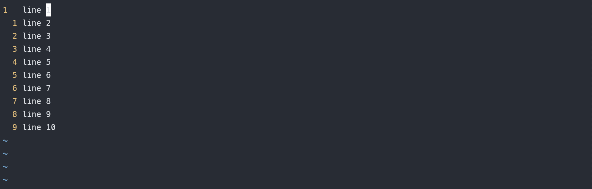
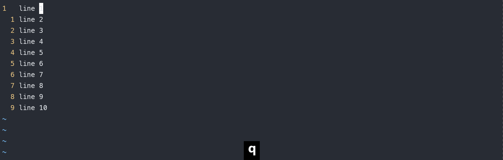
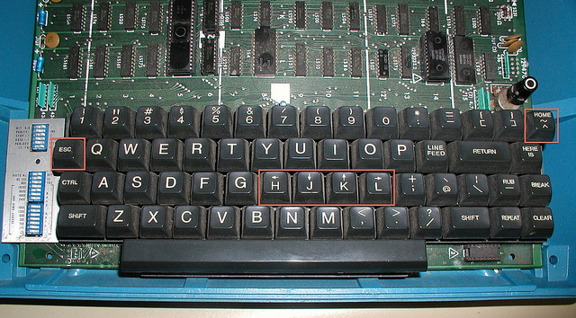
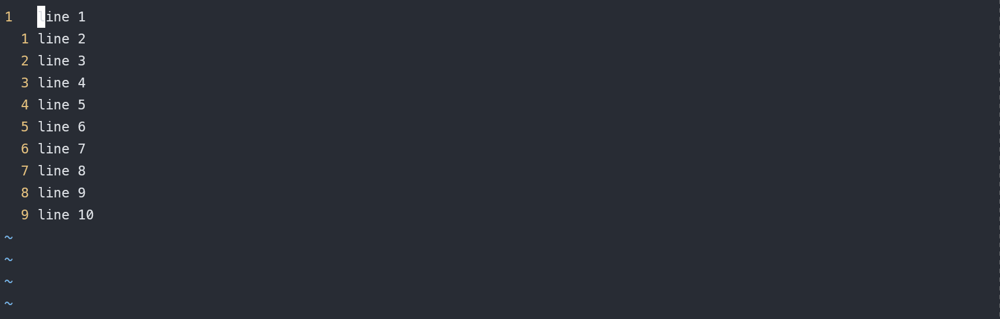
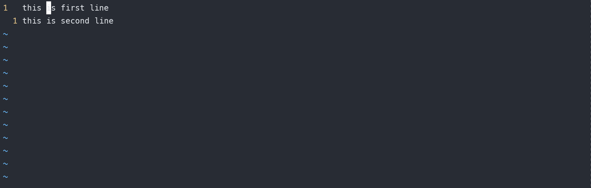
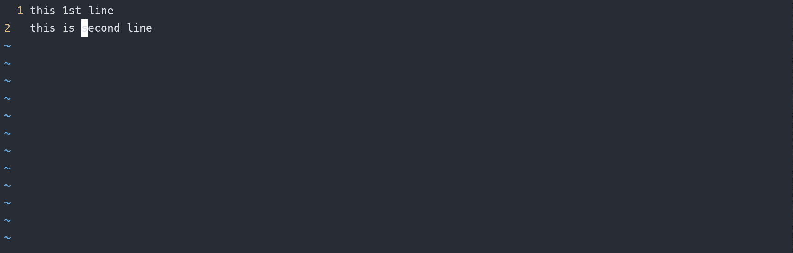
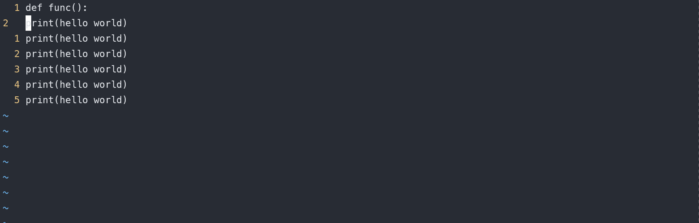

# vim 从嫌弃到依赖（2）——vim 模式

在上一篇文章中我们获取到了neovim 并对它进行了基础配置。现在已经具备一般编辑器的基本功能了。让我们先学会如何使用vim基本功能进行编辑，后面再看如何进行配置，以达到某某IDE或者编辑器的效果

## vim 为何高效

这里我们先聊聊vim为何高效。一般进行编辑工作，不管是使用Word，记事本，写PPT，对于文本的操作无外乎这么几种操作

- 移动光标到指定位置
- 输入
- 删除
- 替换(删除 + 输入)

而vim之所以高效就是将这几个部分分解为几个模式，不同的模式针对这些场景进行了一些优化。下面是几个简单的示例

1. 将多行文字合并为1行
<div style="align: center">

</div>
2. 删除前5行
   <div style="align: center">

</div>
3. 将每行后面的数字+1
   <div style="align: center">

</div>
   这些操作先卖个关子，暂时不去管他们，接下来简单说说vim的几种模式，然后了解一下移动光标的一些命令，最后提供一个能描述vim操作逻辑的公式

## vim的几种模式

vim主要分为一下几个模式

- 普通模式 (normal mode)
  不出意外的话，在使用vim的时候大部分时间停留在普通模式下，并且很多操作都是在普通模式下完成的，例如上述的几个例子全都是在普通模式下完成的。移动光标、切换模式都是在普通模式下进行的
- 插入模式 (insert mode)
  插入模式主要用来编辑文本，在该模式下输入的字符都会作为文本的一部分进行保存，在该模式下可以进行文本的编辑操作
- 可视模式(visual mode)
  该模式主要用来选择一部分文本，实现的功能跟用鼠标选中一段文本一样，后续可以输入命令针对被选中的文本进行处理
- 命令行模式(command mode)
  可以在普通模式和可视模式下输入 `:` 进入命令行模式，严格意义上来说，它并不是一个真正的模式。许多复杂的操作其实都可通过一个简单的命令来完成。在命令行中，我们可以执行 vim 自带的命令，也可以执行自定义的命令(例如很多插件都有一些自定义命令)。例如使用 `:w` 来将缓冲区中的内容写入一个文件中，或者使用 `:q` 来退出vim。

## vim 移动光标的几种方式

移动光标可以说是 `vim` 中所有操作里面最基础的操作了。因为 删除， 输入 和 替换 这三个操作都是以光标所在位置为基础做的。可以说，高效的文本处理大多依赖于光标移动的效率，而如何高效的把光标移动到 “目标” 处是一个不小的学问。

一般来说普通的编辑器移动光标的方式都是通过手去移动鼠标，通过鼠标来定位到光标要移动的位置，这么做并不高效。原因是在移动鼠标的过程中涉及到将手由键盘移开，将手放到鼠标上、找到对应位置然后移动光标，最后再将手由鼠标移动到光标上。这些动作不仅打断了键盘输入，同时也打断了我们输入的思路。要做到高效移动光标首要的就是手不要离开键盘（尽量不要大范围的移动手）。

`vim` 的普通模式完美的解决了这个问题，在普通模式下提供了丰富的操作来移动光标，下面列举一些常用的

- h: 向前移动一个字符
- l: 向后移动一个字符
- j: 向下移动一行
- k: 向上移动一行
- b: 向前移动一个单词
- w: 向后移动一个单词
- e: 移动光标到单词尾部
- ^: 移动光标到行首第一个非空字符处
- $: 移动光标到行末最后一个非空字符处
- gg: 移动光标至文件首行的首个非空格字节
- G: 移动光标至整个文本最后一行的首个非空格字节()
- %: 移动光标到匹配括号的另一端
- 0: 移动光标至行首

说句题外话，`vim` 使用 `h j k l` 来代替 `← ↓ ↑ →` 主要是因为当年创建 `vi` 的时候键盘张这样

<div style="align: center">

</div>
如果仅仅使用上述介绍的内容进行移动光标，一次移动一个字符、一个单词、一行，这效率也太低了，无法处理需要大幅度跳转光标的需求。这里介绍一个公式

```
数字 + 移动光标
```

例如上述介绍的移动光标的方式都可以采用这个公式。前面的数字表示按同意的操作移动光标的次数，例如 `2w` 表示向后移动两个单词，`3j` 表示向下移动3行。

<div style="align: center">

</div>
我们把这个公式总结为

```
motion = [数字] + 移动光标
```

上述公式可以理解为 motion就是定义了如何移动光标

## vim 基础操作之删除和替换

移动光标之后，接下来应该就是进入输入模式进行输入操作，但是这里我们先不谈输入模式。其实在忽略在输入模式下的各种操作技巧，输入模式中剩下的就是输入各种字符完成输入操作，相对比较基础，这里先不谈它。我们先来说说在普通模式下的删除和替换操作。

删除操作使用 `d`(你可以理解为英文单词 `delete` 的首字母)，替换操作使用 `c`(也就是 `change`)

我们输入 `d` 或者 `c` 发现操作卡住了，其实这个时候vim在等用户输入对应的范围即 `motion` ，表示针对哪个范围的文本进行该操作，这里我们引入第二个公式

```
operate = operator + motion
```

公式可以理解为，一个操作等于我们想要多多大范围的文本进行何种操作。例如 `cw` 表示针对一个单词进行替换操作，`d2w` 表示对光标后2个单词进行删除操作，这么写也比较符合我们平时使用的日常语言，例如 `d2w = delete 2 words` (删除两个单词)

- 示例： 使用 `c2w` 删除两个单词并进入插入模式
  <div style="align: center">

</div>
- 示例： 使用 `d$` 删除光标后至行尾的所有内容
  <div style="align: center">

</div>
  其实类似 `d` 和 `c` 的操作还有很多，例如
- \>: 右缩进
- <: 左缩进
- =: 自动缩进
- y: 赋值
- p: 粘贴
- gu: 变为小写
- gU: 变为大写
- g~: 反转大小写
- 示例：使用 `>G` 将当前行至文件尾部的代码进行缩进
  <div style="align: center">

</div>
  我们也可以在 `operator` 前添加数字，表示执行操作重复次数，这里我们的公式就可以进行改写

```
operat = [数字] + operator + motion
```

例如 `2dw` 表示删除一个单词并将该操作执行两遍。它与前面演示的 `d2w` 能达到相同的操作，但是含义不同。`d2w` 表示一次删除两个字符。理解了这个，这里我提出一个简单的问题 `2d2w` 的等效操作是哪两个呢，欢迎评论区给出。

## 以行为单位的操作

例如我们要删除一行，根据以上学习的内容可以想到使用 `dj` ,但是实际尝试的时候发现它删除了两行。我们还可以想到先使用 `0`将光标移动到行首,然后使用 `d$` 删除整行，但是会发现它会留下一个空白行。

如果想针对行本身进行操作的话，需要将同样的操作同时按两下，即 `dd` 表示删除一行,`>>` 表示缩进当前行。这里我们可以扩展一个公式

```
operat = [数字] + 2 * operator
```

即重复按下两次同样的操作命令表示针对行进行操作，前面加上数字表示重复多少次。举几个例子

- `5dd` 删除5行
- `4>>` 将4行代码进行缩进
- `2cc` 更改接下来的两行，并进入插入模式

## 最后的总结

本篇到这里就结束了，最后做一下总结，我们提到几个公式

```
motion = [数字] + 移动光标
operat = [数字] + operator + motion
operat = [数字] + 2 * operator
```

根据这些公式我们可以根据具体情形自由发挥想象。它是vim的基础也是体现它高效的一个地方。

另外还介绍了一些常用的移动光标的方式和常用的操作符，这里再次将他们列举出来以供查阅
**几种常用motion**

| motion | 含义                                         |
| ------ | -------------------------------------------- |
| h      | 左移                                         |
| j      | 下移                                         |
| k      | 上移                                         |
| l      | 右移动                                       |
| w      | 向后移动一个词                               |
| b      | 向前移动一个词                               |
| e      | 移动光标至词末                               |
| $      | 移动光标至行末                               |
| 0      | 移动光标至行首                               |
| ^      | 移动光标至本行首个非空格字节                 |
| gg     | 移动光标至文件首行的首个非空格字节           |
| G      | 移动光标至整个文本最后一行的首个非空格字节() |
| %      | 移动光标到匹配括号的另一端                   |

**几种常用操作符**

| operator | 含义                                                       |
| -------- | ---------------------------------------------------------- |
| c        | 修改，删除当前并切换到 `insert mode`                     |
| d        | 删除，该命令与motion配置使用，表示删除光标移动过的所有内容 |
| >        | 右缩进                                                     |
| <        | 左缩进                                                     |
| =        | 自动缩进                                                   |
| y        | 赋值                                                       |
| p        | 粘贴                                                       |
| gu       | 变为小写                                                   |
| gU       | 变为大写                                                   |
| g~       | 反转大小写                                                 |
