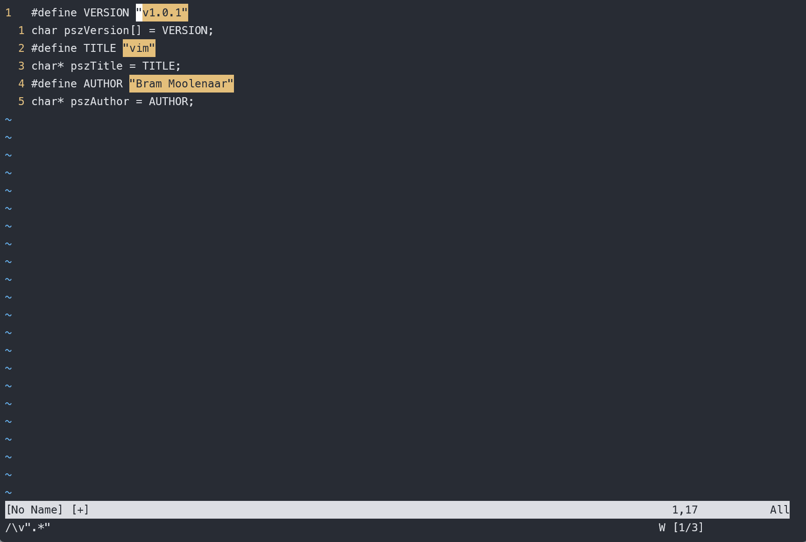
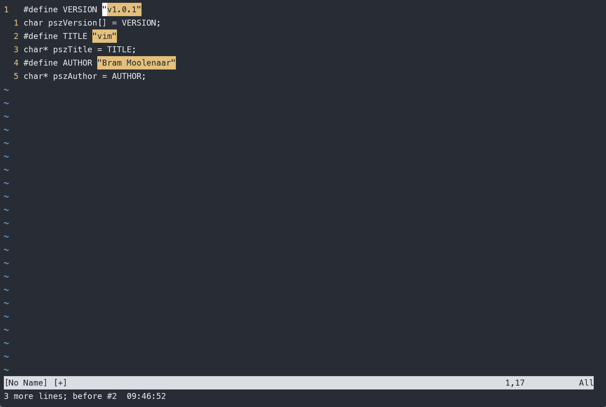
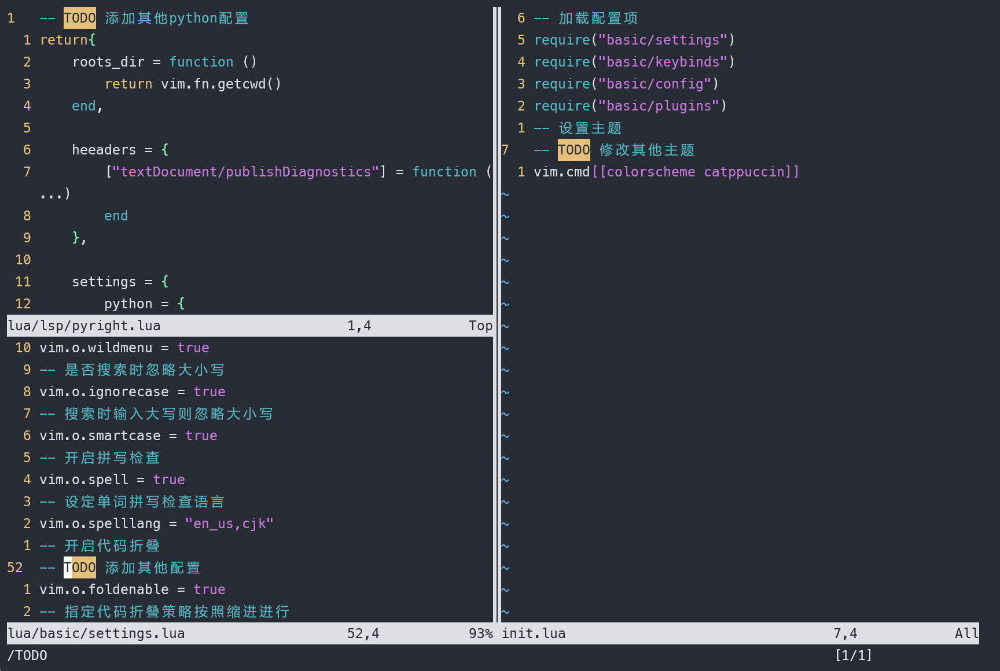
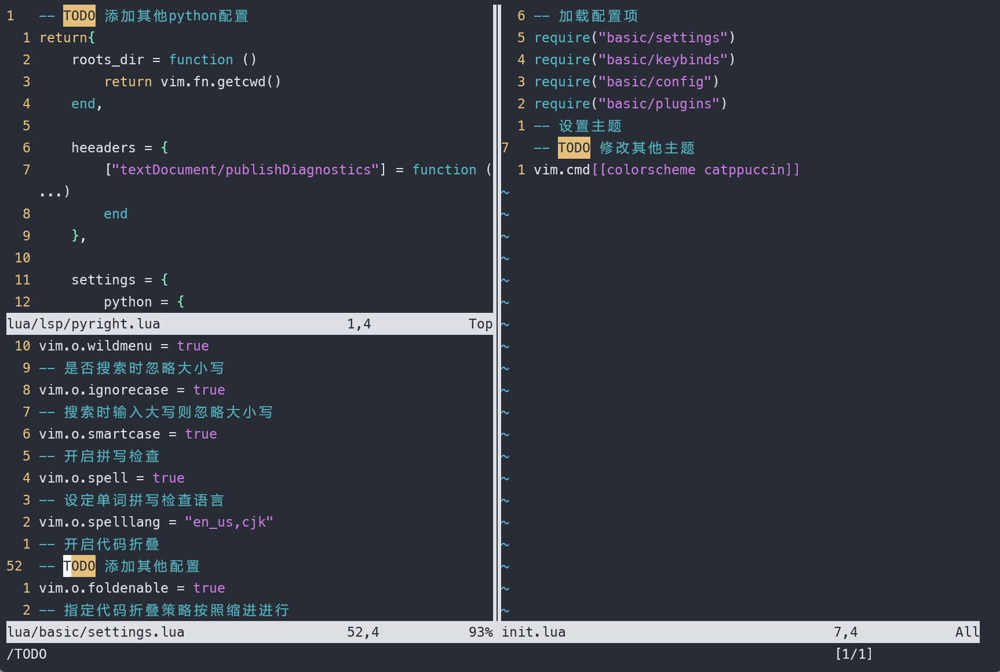
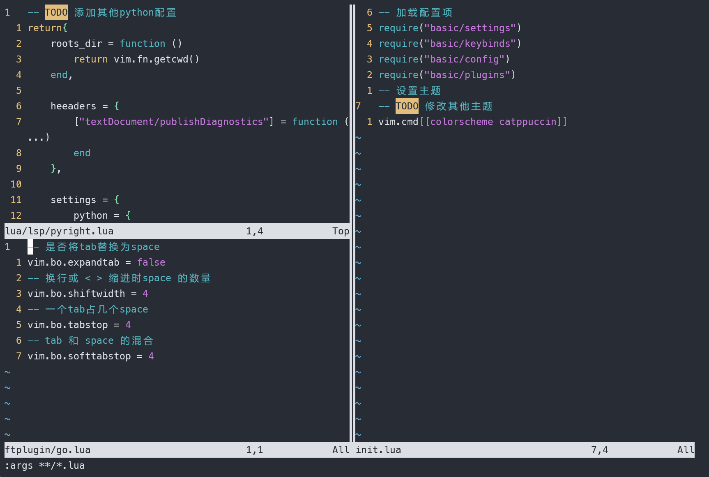
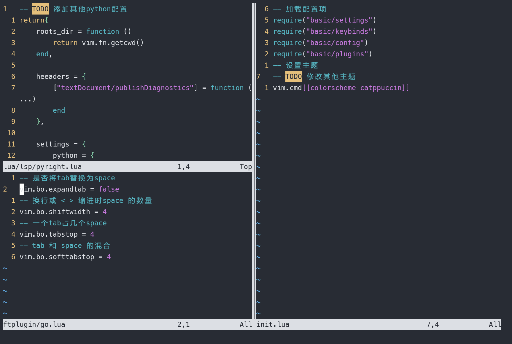
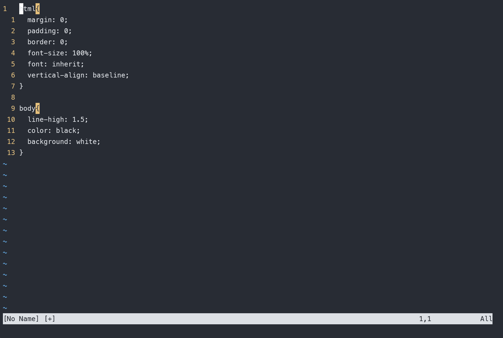
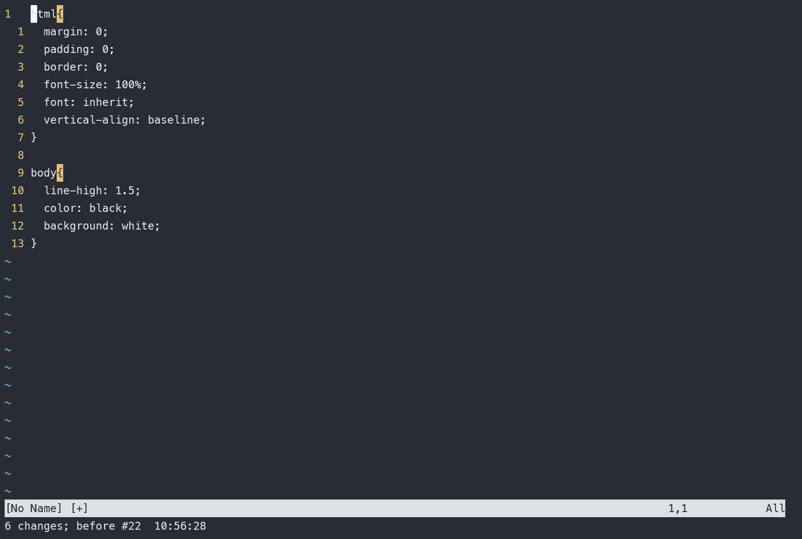
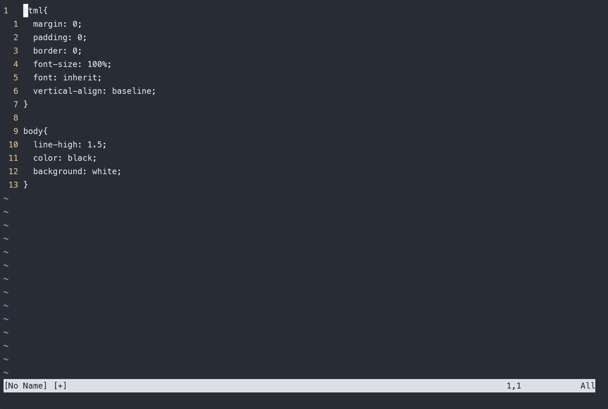

# vim 从嫌弃到依赖(20)——global 命令

在前面的文章中，我们介绍了如何进行查找和替换，而替换是建立在查找基础之上的一个简单的应用，它只是将匹配文本修改为另一个。那么vim中还能针对匹配上的文本做哪些操作呢？在本篇文章中我们来对这个问题进行探讨。

## 初识global 命令

我们能够对存在匹配项的行进行其他操作的关键在于 `global` 命令。`global` 命令的作用是存在匹配项的行上执行指定的ex命令。命令的格式如下:

```vimscript
:[range] g[lobal][!]/{pattern}/[cmd]
```

- 与大多数ex命令一样，它接收一个作用范围。如果不给范围，则默认作用于整个文件，即它默认范围是 %
- ! 代表取反，是在不存在匹配项的行上执行ex命令
- pattern 表示匹配模式
- cmd表示将在对应文本上执行哪些ex命令。如果不指定则默认执行 print命令

这里需要强调的是，执行ex 命令操作的是有匹配项的行。操作的不是高亮的文本，而是有高亮文本的行。

我们还是以一个简单的例子来演示如何使用

```c
#define VERSION "v1.0.1"
char pszVersion[] = VERSION;
#define TITLE "vim"
char* pszTitle = TITLE;
#define AUTHOR "Bram Moolenaar"
char* pszAuthor = AUTHOR;
```

假设有这么一段代码，我们先用 `".*"` 来匹配一个字符串，然后执行 `:g//d` 来执行删除操作。
&#x20;

<figure><figcaption></figcaption></figure>

我们发现它并不是删除了后面的字符串而是将所有有字符串的行都删除了，只保留了赋值语句。相信通过这个例子各位小伙伴应该已经理解 `global` 命令是如何作用的。

如果我们要删除上述代码中所有的赋值语句，可以利用 !来进行取反，`:g!//d`
&#x20;

<figure><figcaption></figcaption></figure>

在 《vim 实用技巧》这本书中提到一个很有意思的东西。通过上面的描述，可以总结出 global命令的一个简写形式 `:g/re/p` 其中 `g`是 `global`命令的缩写，`re`代表正则表达式 `regular expression`, 而 `p` 则是 `print`的缩写。我们将 `/` 从中去掉就发现这个简写变成了 `grep` 这个单词。这也就是 `grep` 这个命令的由来。

上面的内容已经初步介绍了 `global` 命令的使用，下面再来看看其他的使用场景

## 配合缓冲区参数列表使用

我们还是用 `neovim` 的配置文件。我们随机在部分 `lua` 文件中加一些  `TODO` 的注释。表示暂时未做将来会实现的功能。
&#x20;

<figure><figcaption></figcaption></figure>

我们先在某个文件中查找 TODO字样，有的文件显示没有找到也不要紧，只是为了保存这个模式
然后将所有的 `lua` 文件加入到参数列表中，`:args **/.*lua`
&#x20;

<figure><figcaption></figcaption></figure>

然后选择清空一个寄存器 `qaq` ，其中 `qa` 代表我们将要使用 `a` 寄存器来录制一个宏，不输入任何内容直接使用 `q` 结束录制。因为宏就是将操作内容写入寄存器，所以不进行任何操作的宏就可以清除寄存器的内容。
&#x20;

<figure><figcaption></figcaption></figure>

然后执行 `:argdo g//yank A` 这里使用 `yank` 这个命令来复制内容到寄存器。另外使用了 `A` 而不是 `a` 因为这里是对每个文件依次执行命令的，需要一个个的添加到寄存器里面。所以这里使用大写字母。
&#x20;

<figure><figcaption></figcaption></figure>

此时可以查看 `a` 寄存器的内容，发现已经有对应内容了。

提取出来的内容有一个缺点就是无法显示具体是哪个文件中的 `todo` 项。将未来要实现但是现在没实现的功能用 `TODO` 描述出来在编程中是一个很常见的习惯，针对这个功能有许多做的不错的插件，后续将会介绍相关插件。

## 指定 ex 命令的执行范围

不光 global可以指定范围，后面接的 cmd也可以指定范围，下面将通过一个演示该如何使用
假设有一段 `css` 代码

```css
html{
  margin: 0;
  padding: 0;
  border: 0;
  font-size: 100%;
  font: inherit;
  vertical-align: baseline;
}

body{
  line-high: 1.5;
  color: black;
  background: white;
}
```

我们想对每组css内部属性按字母顺序进行排序。
第一个办法：可以录制宏来自动化。首先通过模式来匹配 `{` 即使用 `/{` 然后开始录制宏： `nvi{:sort` ，首先通过 `n` 来跳转到下一个匹配，然后使用 `vi{` 通过文本对象来选中 `{}` 中的内容，最后针对选中来执行 `sort` 命令
&#x20;

<figure><figcaption></figcaption></figure>

&#x20;

<figure><figcaption></figcaption></figure>

但是我们可以使用 `global` 命令完成同样的操作。首先还是来构造对应的模式。我们可以通过 `:g/{/ .+1,/}/-1 sort` 这么一条命令来完成这一操作。我们来分析一下这条命令的意思。

- 首先将这条命令按照 `/` 分为3个部分，第一部分是 `{` 表示匹配所有 `{` 之后的内容。
- 第二部分是 `.+1,/}/-1` 。它表示一个范围，范围分为两个部分，以 `,` 分割，前面一部分代表的是当前行的下一行，也就是 `{` 所在行的下一行，`/}` 表示匹配结束的 `}` 符号，后面跟一个 `-1` 表示 `}` 所在的上一行，这个范围代表的就是 `{}` 之间的所有行。
- 最后一个部分是命令也就是 `sort`，在对应的这个范围中执行 `sort` 命令。
&#x20;

<figure><figcaption></figcaption></figure>

  针对上面解释的内容，我们可以对 global命令再做一个详细的使用格式：

```vimscripts
:[range]/g[lobal][!]/{start pattern}/ .{offsize},/{end pattern}/{offsize} [cmd]
```

这里我们也可以跟其他命令，例如将C函数中的代码进行缩进，那么就可以使用 `:g/{/ .+1,/}/-1 >` 。
