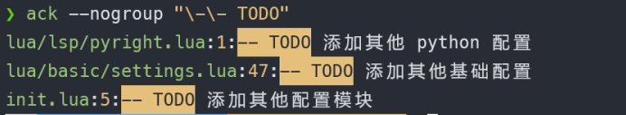

# vim 从嫌弃到依赖(21)——跨文件搜索

之前介绍了vim中的搜索模式，使用正则表达式可以很方便的在一个文件中进行搜索。后续也介绍了如何使用 `argsdo` 命令在参数列表中进行替换操作。但是到目前为止还没有介绍如何在工程目录中进行搜索，而这个功能是其他编辑器的基本功能。

vim 主要运行在 `unix` 平台，而 `unix` 平台信奉的哲学是专门的软件做好专门的事，在多个文件中搜索关键字是 `grep` 这个程序的工作，vim本身并没有单独提供类似 `grep` 的功能，而是提供了方法直接调用 `grep`。本篇我们将要讨论在vim中是如何调用 `grep` 进行搜索的。并且介绍其他搜索整个工程中代码的方式。

提前声明一下，因为vim中 `grep` 命令与 shell中的 `grep` 重名了，容易造成误解，因此这里采用 `:grep` 来表示 vim 中的 `grep` 命令，`grep` 来表示 shell中的 `grep`，也就是 vim中的命令都以 `:` 开头

## grep 命令

vim 中也提供了 `:grep` 命令，它是对 shell 中 `grep` 的封装。它可以让我们直接在vim中使用 `grep`并且可以在vim中显示结果（当然我们也可以在命令模式中使用 `:!grep` 来调用shell的 `grep` 命令）。

我们仍然以前面介绍的搜索 `TODO` 标签为例。
我们先在 `shell` 中使用 `grep` 命令。

```shell
grep -n "\-\- TODO" **/*.lua
```

因为 `--TODO` 中的 `-` 在shell中是传参的标志，所以这里需要进行转义。`-n` 表示在输出的结果中显示行号。`**/*.lua` 表示在所有lua文件中进行搜索。我们可以看到，它输出了我们想要的结果。
&#x20;

<figure><figcaption></figcaption></figure>

我们该如何根据这个结果快速跳转到对应位置呢？例如要跳转到 `lua/basic/settings.lua` 的第5行， 我们可以在 `shell` 中可以使用 `nvim lua/basic/settings.lua +5` 表示打开到该文件并跳转到第5行。

&#x20;

<figure><figcaption></figcaption></figure>

当我们要频繁不同文件间进行跳转的时候，要频繁的退回到 `shell` 并执行 `vim` 来打开，操作上比较繁琐。`vim` 为这种需求提供了自己的工具—— `:grep` 命令和 `:vimgrep`

在vim中输入 `:grep "\-\- TODO" **/*.lua` 会发现 vim 在下方显示了当前所有搜索到的内容。
&#x20;

<figure><figcaption></figcaption></figure>

这里我们没有加上 `-n` 选项，但是它仍然显示了行号，vim默认自动为 `grep` 添加了 `-n` 选项。这些内容被存储在一个被称之为 `quickfix` 的列表中。可以通过这个列表快速跳转到对应的位置。

## 遍历 quickfix 列表

`quickfix` 列表是由我们执行 `:make` 命令或者 `:grep` 命令所产生的，它会保存一个或者多个文件位置信息。我们可以使用以 `c` 开头的一组命令来遍历，下面列举出相关的命令：

- cnext：跳转到下一项
- cprev：跳转到上一项
- cfirst：跳转到第一项
- clast：跳转到最后一项
- cnfile：跳转到下一个文件的第一项
- cpfile：跳转到上一个文件的第一项
- cc n：跳转到第你项
- copen：打开 quickfix列表
- cclose: 关闭 quickfix列表

后续使用 vim 时会大量使用到 `quickfix` 列表，为了减轻输入的负担，可以考虑将其定义为快捷键。

`:cnext` 和 `:cprev` 命令前面可以加数字表示向后或者向前跳转多少次。例如我这里使用 `:2cnext` 表示向后跳转2次。
&#x20;

<figure><figcaption></figcaption></figure>

我们可以使用 `:copen` 来使用新的窗口来显示 `quickfix` 列表中的内容。在这个窗口中可以使用 `motion` 命令来移动光标。`quickfix` 列表无法进行修改，因此这里只能移动光标。它比较特别的一点在于，如果我们在某一行按下回车键，那么vim会自动跳转到光标所在行对应的位置。`quickfix` 所在窗口总有一项处于高亮状态，这个状态表示当前我们在访问哪个位置的内容，我们可以通过窗口跳转来改变高亮的行，执行 `:cnext` 和 `:cprev` 以及 `cc` 之类的命令也可以修改当前高亮的行。例如我在这里执行 `:cc 2` 来跳转到第二条记录
&#x20;

<figure><figcaption></figcaption></figure>

另外 vim 会自动保存之前产生的 `quickfix` 列表，并不会随着执行新的 `:grep` 而发生覆盖。我们可以使用 `:colder` 来查看上一个列表，使用 `:cnewer` 来查看下一个。

## 定制 grep命令

`vim` 中的 `:grep` 是对 `shell` 中的 `grep` 的一个封装。前面说道，`vim` 中的 `:grep` 命令会默认加上 `-n` 这个选项，而 `grep` 还可以使用 `-i` 来忽略大小写，我想把这项也加入到 `:grep` 命令中该如何做呢？另外 `:grep` 是对 `shell` 中的 `grep` 的封装，现在我有更好的文本搜索工具，我想用它来替换 `grep` 该如何做呢？还有一个很奇怪的点，在使用 `:grep` 进行搜索的时候，我们明明输入的是 `:grep "\-\- TODO **/*.lua"` 但是它给我们显示结果的时候显示的却是 `:!grep -n "\-\- TODO" **/*.lua /dev/null 2>&1| tee /tmp/nvimPRHF8B/6` 这是为什么呢？在这一小节我们将来探讨这些问题。

当我们通过 `vim` 来执行 `:grep` 命令的时候，`grepprg` 负责制定将要调用的 `shell` 命令。`grepformat` 决定如何来 `:grep` 命令的输出结果。
通过使用 `:h grepprg` 和 `:h grepformat` 看到，它们自身在 `vim` 中的默认值如下:

```viml
grepprg = "grep -n $* /dev/null"
grepformat = "%f:%l:%m,%f:%l%m,%f  %l%m"
```

在 `grepprg` 中 `$*` 表示占位符，它将被 `:grep` 命令中输入的内容替换，这也就解释了为什么最后在显示的时候，会在我们输入的基础之上加上了后面那些内容。 我们只需要对其做一些修改就可以使我们的 `:grep` 自动忽略大小写

```viml
set grepprg=grep\ -n\ -i\ $*
```

&#x20;

<figure><figcaption></figcaption></figure>

&#x20;

<figure><figcaption></figcaption></figure>

我们看到，同样的命令现在多出来了一条小写的结果，另外从它的显示上看也已经加上了 `-i` 选项了。

接下来我们来看看 vim是如何解析 :grep命令输出的。
grepformat中各种匹配格式是按照 ,来进行分割。也就是它定义了多组可能的输出格式，每组以 ,分割。%f表示文件名称、%l表示行号，:m表示匹配的行。

了解这些之后，我们来试试使用别的命令来替换默认的 grep。这里我们以 ack作为演示，当然你也可以使用其他的命令。插一句题外话，我觉得 ack相较于 grep来说，最大的优势在于它可以识别不同的文件类型，这样就可以做到只搜索某一类型文件中的内容，而且默认支持递归搜索当前目录下所有文件。

在 `shell` 中，可以直接使用 `ack "\-\- TODO"` 来搜索所有的 todo项，也可以使用 `-i` 来忽略大小写。在默认情况下 `ack` 会用两行来显示搜索到的结果，第一行是 文件名，第二行是行号和匹配行的内容。
&#x20;

<figure><figcaption></figcaption></figure>

`ack` 默认会搜索当前目录中所有文件中的内容，所以这里可以不需要像 `grep` 那样给出具体的目录。

我们可以使用 --nogroup来达到与 grep相同的输出格式。
&#x20;

<figure><figcaption></figcaption></figure>

我们可以使用 `--nogroup` 来使 `ack` 达到与 `grep` 相同的输出，因此这里也可以不修改 `grepformat` 的内容。我们只需要修改 `grepprg` 即可：

```viml
set grepprg=ack\ --nogroup\ $*
```

另外 `ack` 还支持添加 `--column` 来输出对应的列，配合 `grepformat` 我们可以做到精确定位到对应的行和列。这里我们设置 `set grepprg=ack\ --nogroup\ --column\ $*`。同时设置 `set grepformat=%f:%l:%c:%m`
&#x20;

<figure><figcaption></figcaption></figure>

从上图中可以看到，此时已经可以显示列号了，并且 `grep` 已经被替换成了 `ack` 了

vim 提供了很方便的方式让我们修改 `:grep` 命令的行为。但是我们在执行 `:grep` 的时候发现它在调用 `ack` 命令有时候会造成一定的疑惑或者误解。而且并不是每次我都想使用某一个 `shell` 程序的。例如这次我想用 `grep` 进行搜索，下一次我想用 `ack` 搜索，这样每次修改外部命令，我都得修改 `grepprg` 和 `grepformat` 想想也挺麻烦的。为什么不创建一个 `:ack` 命令专门用于使用外部的 `ack`，或者其他命令专门用于调用其他外部程序呢？目前很多插件都是这么干的。在后续介绍 vim配置的时候我们将会给出这样的例子。

## vimgrep 简介

除了使用 `:grep` 来调用外部的搜索命令外，`vim` 自身也提供了 `:vimgrep` 命令。它最大的特色是支持 `vim` 自己的正则表达式。它的使用格式如下:

```vimscripts
:vimgrep[!] /{pattern}/[j][g] {file}
```

它的使用方式与之前介绍的 搜索模式类似。只是它只支持2个标志，`j` 表示不进行跳转只是将匹配结果保存到 `quickfix` 列表中，默认情况下，它会跳转到第一个匹配的位置，并且将搜索结果保存到 `quickfix` 中。`g` 表示将所有匹配都记录下来，默认只记录每一行第一个匹配处。

因为它与搜索模式下使用的模式相同，因此这里我们可以先用查找模式来在一个文件中进行试验，试验成功后再使用 `vimgrep`，否则错误的结果将会污染历史的 `quickfix` 列表，影响后续使用 `colder` 和 `cnewer` 。

例如这里我还是搜索 `--TODO` 可以现在单个文件中使用 `:\v--\s+TODO`进行搜索。
&#x20;

<figure><figcaption></figcaption></figure>

然后使用模式域留空的方式查找，即 `:vimgrep //gj **/*.lua`
&#x20;

<figure><figcaption></figcaption></figure>

关于 vimgrep的内容就介绍到这里了，一般我很少使用原装的 :grep和 :vimgrep。而是采用功能更加强大的其他搜索插件。各位小伙伴也不需要纠结究竟掌握它们中的哪个好，有更好的，直接用更好的就行。
