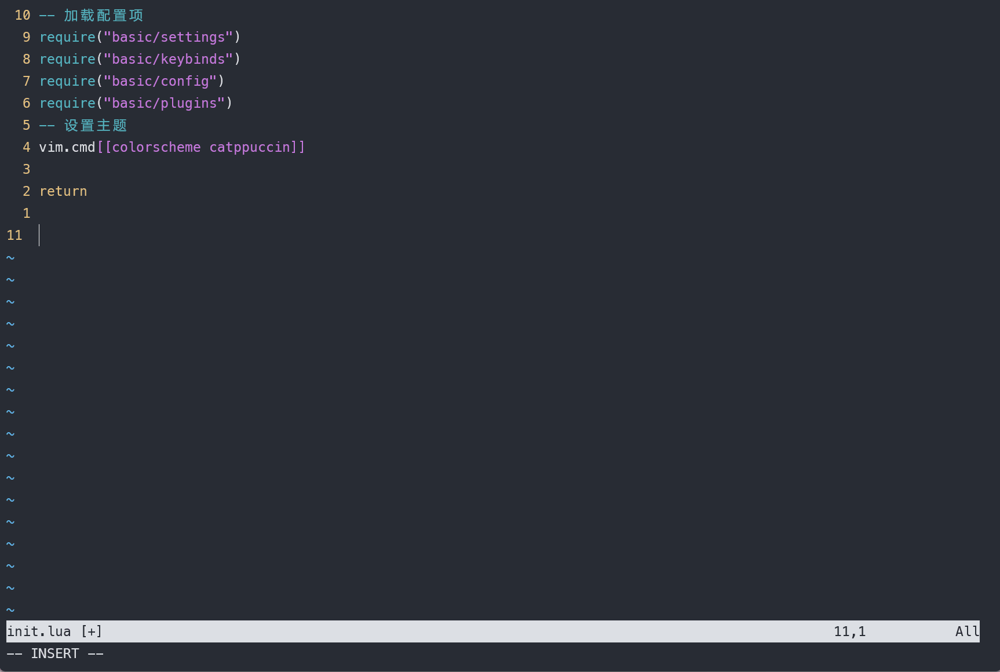
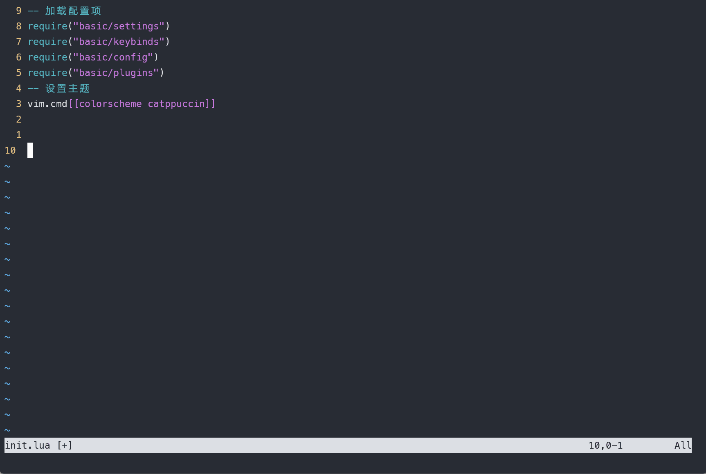
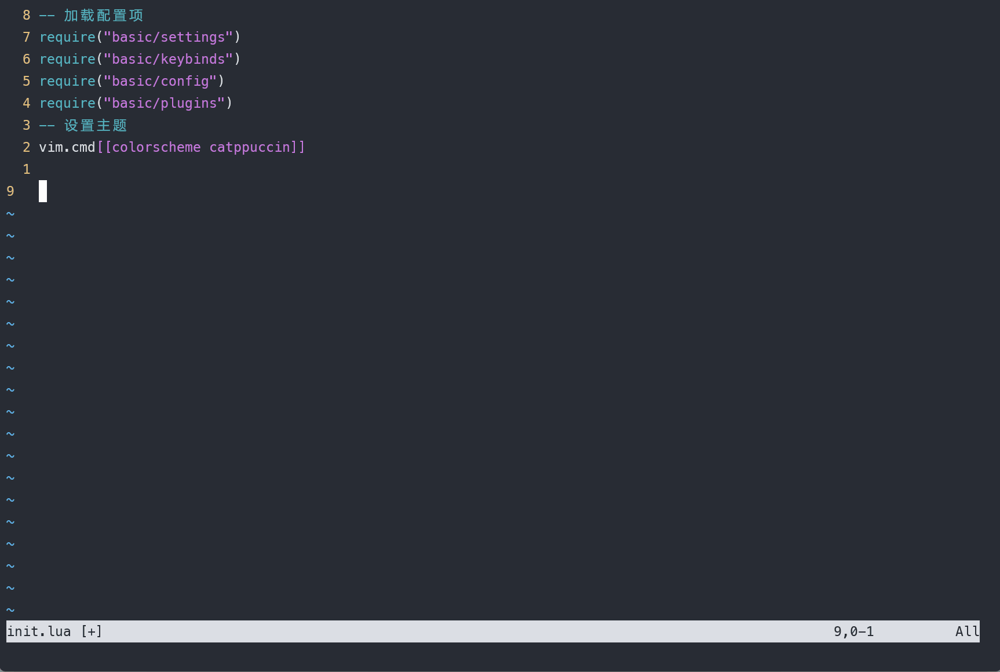
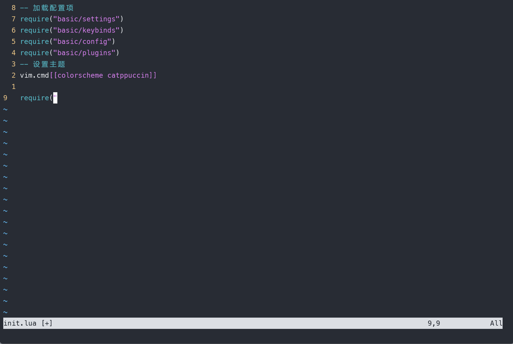
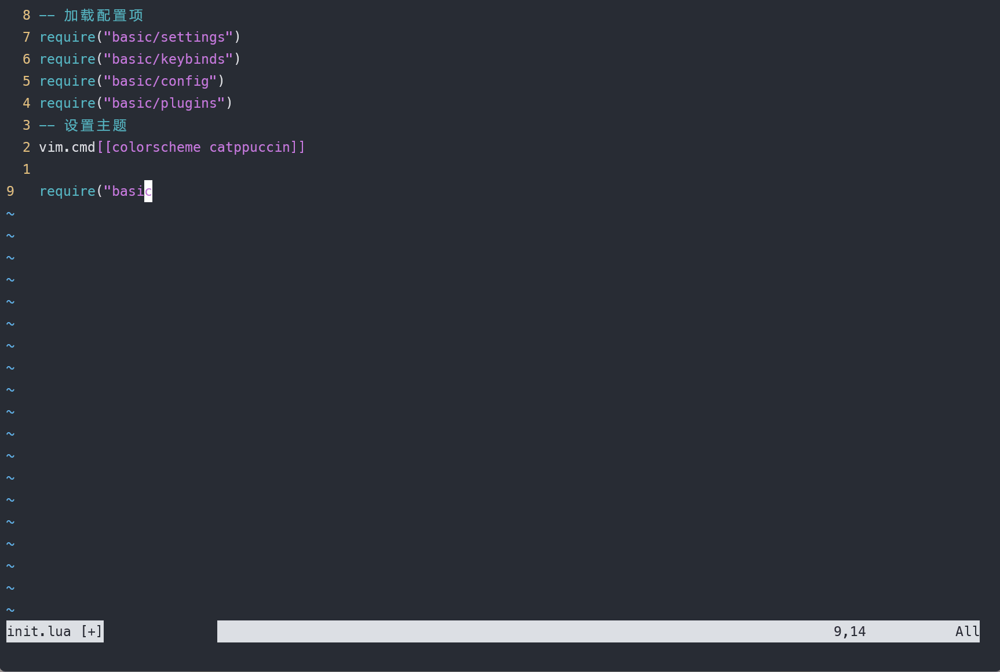
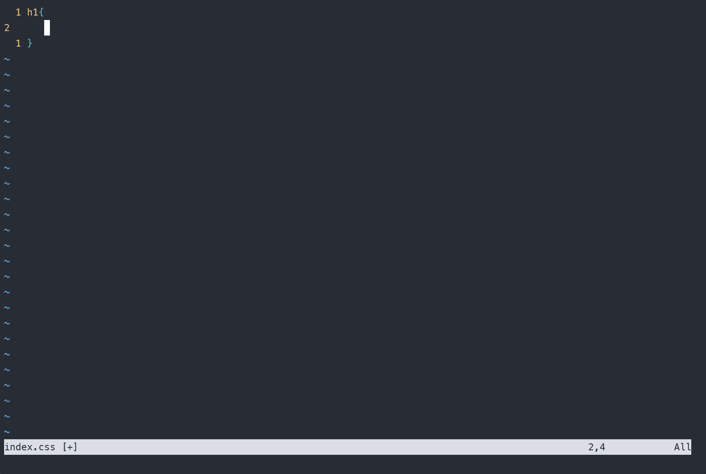

# vim 从嫌弃到依赖(22)——自动补全

这篇文章我们将讨论 vim 自带的自动补全功能。当然，针对自动补全功能有许多好用的插件，但是了解vim自带的功能有助于我们更好的用来插件的补全功能。因为我见过有的配置文件将插件的功能配置的比原有的更难用，而且只用基本的功能不一定有原版的好用。所以这里也介绍一下原始版本用法，算是帮助各位在以后的配置中提供一个标杆。

## make 命令

在了解自动补全之前，让我们先简单聊聊 `:make` 这个命令，它与上一篇文章中介绍的 `:grep` 命令类似，也是对 `shell` 命令的一个封装。它默认封装的是 `make` 命令。

我们对 `c/c++` 语言执行 `:make` 也就是在调用 `shell` 中的 `make` 命令。它会将编译产生的错误信息存储在 `quickfix` 列表中。我们上一节中介绍了如何操作 `quickfix` 列表。也介绍了如何对 `:grep` 命令进行改造。同样的 `:make` 也支持使用相同的方法进行改造。

`:make` 命令中，使用 `makeprg` 来执行外部命令，使用 `errorformat` 来格式化输出到 `quickfix` 中。它们默认的值如下:

```vim
makeprg="make"

errorformag="errorformat=%*[^"]"%f"%*\D%l: %m,"%f"%*\D%l: %m,%-G%f:%l: (Each undeclared identifier is reported only once,%-G%f:%l:
for each function it appears in.),%-GIn file included from %f:%l:%c:,%-GIn file included from %f:%l:%c\,,%-GIn file incl
uded from %f:%l:%c,%-GIn file included from %f:%l,%-G%*[ ]from %f:%l:%c,%-G%*[ ]from %f:%l:,%-G%*[ ]from %f:%l\,,%-G%*[
]from %f:%l,%f:%l:%c:%m,%f(%l):%m,%f:%l:%m,"%f"\, line %l%*\D%c%*[^ ] %m,%D%*\a[%*\d]: Entering directory %*[`']%f',%X%*
\a[%*\d]: Leaving directory %*[`']%f',%D%*\a: Entering directory %*[`']%f',%X%*\a: Leaving directory %*[`']%f',%DMaking
%*\a in %f,%f|%l| %m"
```

可以调整它们的值来适配不同的外部命令。这里就不再详细展开了，相信阅读过上一篇文章的小伙伴对这个应该不陌生。本来 `:make` 命令是vim中十分有用的一个命令，应该单独写一篇文章的。但是它于 `:grep` 重复度太高了，所以我决定在介绍其他内容的时候一笔带过。想了解详细信息的可以参考vim的用户手册。

## 自动补全

自动补全可以在插入模式下触发，当我们触发补全功能的时候，vim会根据当前编辑会话中所有缓冲区的内容建立一张补全列表，然后根据当前光标左侧的字符进行检测，看在表中能否找到单词的一部分，能找到则会用这个未完成的单词对补全列表进行过滤，所以不是以它为开头的单词都被过滤掉，剩余的组成一个弹出式菜单供用户选择。效果如下：
&#x20;

<figure><figcaption></figcaption></figure>

上述例子中，因为以 `re` 开头的原本只有 `require` 一项，为了展示补全效果这里我们新增一个以 `re` 开头的 `return`

我们使用 `<Ctrl +p>` 和 `<Ctrl + n>` 来切换补全菜单中的上一条和下一条。除了这个，我们还有其他的用于操作补全菜单的快捷键。

- `<Ctrl - n>` : 使用来自补全列表中的下一项内容(next)
- `<Ctrl - p>` : 使用来自补全列表中的上一项内容(prev)
- `<Down>` : 与 `<Ctrl -n>` 相同
- `<Up>`: 与 `<Ctrl - p>` 相同
- `<Ctrl -y>` : 确认使用当前选中的匹配项
- `<Ctrl - e>` : 还原最初的输入项
- `<Ctrl -h>` : 从当前匹配项中删除一个字符
- `<Ctrl - l>` : 从当前匹配项中增加一个字符

一般在输入字符的时候，如果有匹配项可以匹配vim会自动弹出，或者也可以手动使用 `<Ctrl - n>` 弹出匹配项菜单。在确定要使用的匹配后可以使用 `<Ctrl-y>` 来确认

有时候虽然弹出了匹配项菜单，但是匹配项太多了，而你需要的单词又在列表的太后面，这个时候可以使用 `<Ctrl - e>` 来退出菜单，手动输入几个字符使匹配项更加精确。或者也可以输入 `<Ctrl -p>` 到达最开始的项，即我们目前的输入，然后再次输入字符来精简菜单项，接着使用 `<Ctrl - n>` 弹出菜单。使用这种方式来一步一步的逼近我们想要的结果

&#x20;

<figure><figcaption></figcaption></figure>

## 自定义补全项来源

默认情况下，vim 补全项主要来源于以下几个地方：

1. 缓冲区列表：vim补全项最基本的来源就是当前的缓冲区列表。它可以通过 `<Ctrl - x><Ctrl - n>` 来触发该项。
2. 包含文件，所有的编程语言都有包含文件的概念，例如 `c/c++`中的 `#include` , `python` 中的 `import` 。使用 `<Ctrl-x><Ctrl-i>` 可以触发这个选项，让vim从被包含文件中提取补全项。vim本身使用 `c` 语言编写的，它能够识别 `c/c++` 语言中的关键字，我们可以指定 `include` 项来使 vim认识其他不同的关键字。一般常用的编程语言 vim 都能够识别，因此不需要修改 `include` 项。
3. 标签文件，我们使用 `ctags` 或者类似的插件的时候会生成一个标签文件，该文件会将扫描到代码中的关键字、函数、变量等的索引放入到一个文件中以供后续进行跳转。同时他们也会产生一系列的补全项到补全列表中。可以使用 `<Ctrl+x><Ctrl+]>` 来触发

一般直接使用 `<Ctrl + n>` 触发的是当前缓冲区列表中的补全项，使用 `<Ctrl+x>` 作为前缀，可以触发其他类型的补全项。这么做有一个好处是尽量精简补全列表，减少了我们手动遍历的过程。但是有时候我们并不知道我想要的内容该从哪里来，有没有什么办法能做到，用 `<Ctrl + n>` 这个按钮就可以调用其他所有来源的补全项呢？

要做到这点，可以使用 `complete` 这个配置项。该项包含一组由逗号分隔的单个字符表示的参数，当参数出现时表示需要扫描该参数代表的位置。使用 `set complete?` 可以看到，缺省项为 `complete=.,w,b,u,t` 。我们可以使用 `set complete-=i` 或者 `set complete+=k` 来删除或者添加某个扫描位置。常见的位置参数如下所示：

- `.` : 表示当前以打开的缓冲区
- `w` : 当前打开的窗口
- `b` : 当前缓冲区列表
- `u` : 当前处于缓冲区列表中，但是未打开的缓冲区
- `t` : 当前标签文件
- `U` : 当前打开的，不属于缓冲区列表中的缓冲区
- `k` : 从字典文件中加载的补全项
- `i` : 从当前文件和包含文件中读取
- `d` : 从当前文件和包含文件中读取使用 define定义的宏

完整的内容可以使用 `:h 'complete'` 来查看。

## 使用字典文件

在上面的论述中，我们可以知道 vim 是可以自定义补全的字典文件，然后从字典中产生匹配的。我们可以使用 `<Ctrl-x><Ctrl-k>` 来加载字典中的匹配项。

我们可以使用 set spell来启动拼写检查，拼写检查也会产生新的字典文件。如果不想使用该项，也可以使用 set dictionary来指定含有一个或者多个单词的字典文件。

在这个例子中我们在 `nvim-config` 目录中新建一个 `spell.txt` 文件，我们在里面写入如下内容

```txt
require
return
request
```

然后使用 `set dictionary=./spell.txt` ，接着删除 `init.lua` 中的 `return` ，输入 `re` 然后使用 `<Ctrl+x><Ctrl+k>` 这个时候我们发现它已经加载了
&#x20;

<figure><figcaption></figcaption></figure>

## 补全整行

除了补全单词，vim还可以补全整行的内容，使用 `<Ctrl+x><Ctrl+l>` 可以触发补全整行的操作。
补全行的补全项来源与补全单词相同，需要注意的是补全行的操作会自动忽略行首的缩进。
&#x20;

<figure><figcaption></figcaption></figure>


补全行的操作与之前介绍的 `yy` 或者 `:t` 产生的效果相同，我们应该要根据实际情况分别使用。

## 补全文件名

在 shell中输入命令可以使用  `<Tab>` 键来自动补全文件路径，vim中使用 `<Ctrl+x><Ctrl+f>` 来对文件路径和文件名进行补全。

需要注意的是当我们使用相对路径来补全文件名时，使用的是工作目录，也就是你从哪个目录中进入的vim。我们可以在 vim中使用:cd来切换工作目录。例如我在 nvim-config这个工程的根目录执行 nvim init.lua，我们在这个文件中希望快速补全 basic/settings.lua这项，我们发现它在补全的时候报错
&#x20;

<figure><figcaption></figcaption></figure>

这个时候我们可以使用 `:cd lua` 来切换工作目录到 `nvim-config/lua` 。这个时候再执行补全命令就可以了。

&#x20;

<figure><figcaption></figcaption></figure>

## 根据具体编程语言生成补全

上述补全在编辑普通文本的时候显的有点用处，但是作为程序员平时在写代码如果只能使用上述方式进行补全肯定会抓狂的。好在vim 提供了像其他IDE那样的基于编程语言的补全方式。使用该补全方式的快捷键为 `<Ctrl+x><Ctrl+o>` 要启用该方式，需要启动文件类型识别。

nvim 中已经启用了这一特性，因此不必特意进行设置，但是这里我还是给出它的配置。

```lua
vim.o.filetype="plugin"
```

或者vim中可以使用如下代码

```vimscript
set filetype=plugin
set nocompatiable # 设置与vi 不兼容
```

例如我们可以尝试着在 `css` 文件中使用补全
&#x20;

<figure><figcaption></figcaption></figure>

vim 本身也确实支持很多语言的自动补全，但是为了获得完整的体验还是推荐使用各种专门的补全插件获得更好的体验

## 最后的总结

在这边文章中，介绍了vim中补全项主要的几个来源分别是：当前缓冲区和缓冲区列表、包含文件、外部程序生成的标签等等。同时也介绍了如何使用快捷键来进行不同项的补全，现在对这些快捷键总结如下：

- `<Ctrl + n>` : 普通关键字补全，主要来源自缓冲区列表和当前缓冲区
- `<Ctrl+x><Ctrl+n>` : 与 <Ctrl+n>作用相同
- `<Ctrl+x><Ctrl+i>` : 从包含文件中获取补全项
- `<Ctrl+x><Ctrl+]>` : 从外部标签中获取补全项
- `<Ctrl+x><Ctrl+k>` : 从字典文件中获取补全项
- `<Ctrl+x><Ctrl+l>` : 补全整行
- `<Ctrl+x><Ctrl+f>` : 补全文件名
- `<Ctrl+x><Ctrl+o>` : 根据编程语言来进行补全
