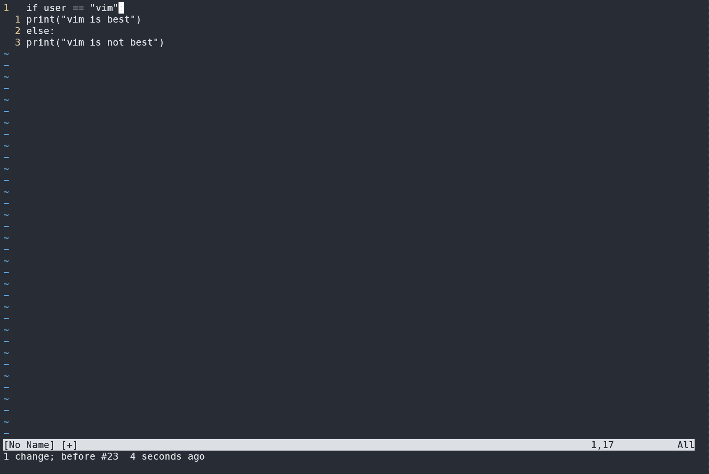
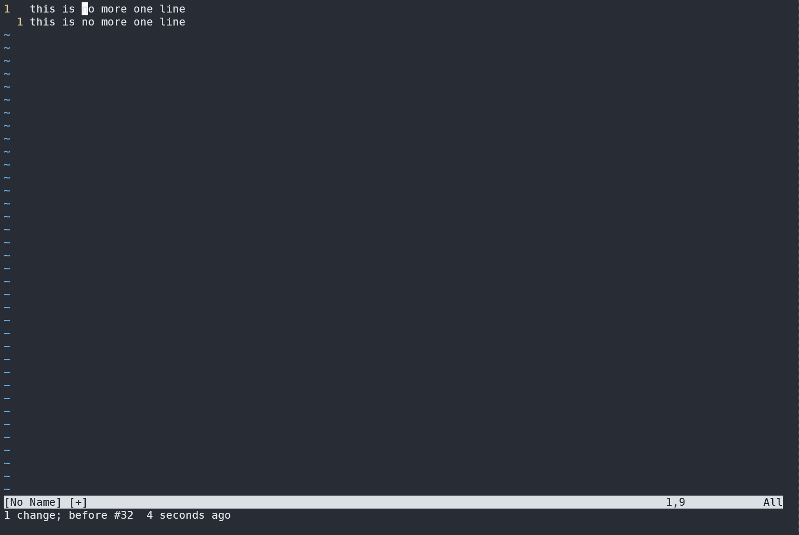
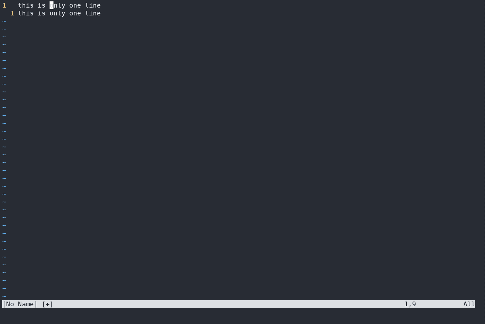
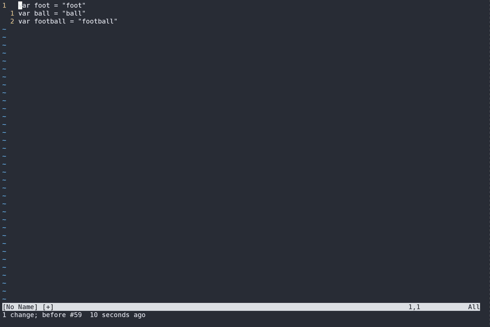

# vim 从嫌弃到依赖(4)—— .命令

通过之前几篇文章的介绍，如果各位小伙伴能够勤加练习，并在日常工作上经常使用，那么相信那些内容已经会对工作效率的提升产生好的影响。但是如果那些就是vim的全部的话，我们也就没那么大的必要花这么大的精力来学习如何使用它，而且它也不会在程序员中口口相传，并且令很多程序员对它如此着迷。接下来让我们更加深入到vim中，去学习更多更好的，可以进一步提升效率的技巧

## Don’t Repeat Yourself. Let vim repeat it for you

不要进行重复的操作，让vim替你自动完成这些重复的操作。

vim之所以好用，效率高。就是它对重复操作进行了大量的优化，并且提供了一些方式方法能让你不必做重复功。而且尽量让这些方法简单易用。最简单的就是使用 `.` 来重复上次修改(确实是够简单的)

废话不多说，还是以例子来说明 假设我有这样一段Python代码

```python
if user == "vim":
print("vim is best!")
else:
print("vim is not best")
```

我需要将第2行和第3行进行缩进，可以这么做，先使用 `j` 移动光标到第二行，然后使用 `>>` 缩进代码，接着使用 `2j` 跳转光标到第四行，然后使用 `.` 重复上一次修改

<figure><figcaption></figcaption></figure>

配合搜索命令可以完成对文本的快速修改，但是我们现在还没介绍到搜索相关操作，所以先按下不表

### 如何定义上次修改

不同的编辑器对上次修改的定义不同，有的可能是词、句子、段甚至有的可能按照输入时间来算，一段时间内的输入算作上次修改，而vim可以自己定义上次修改范围是多少。

vim一般将从进入插入模式开始，到从插入模式退出这段时间内做的修改做为上次修改，或者在普通模式下将我们使用一次 `operat = operator + motion` 公式作为一次修改，例如我们有这么一段话

```
this is no more one line
this is no more one line
```

我们将光标移动到 第一个 `n` 处。然后使用 `d2w` 删除两个单词，然后再下一行再次使用 `.` 发现它执行与上一行一样的操作

<figure><figcaption></figcaption></figure>

在进入插入模式时，连同进入插入模式的操作一起与在插入模式下输入的内容一同被算作上次修改，例如

```
this is only one line
this is only one line
```

改为

```
this is no more one line
this is no more one line
```

我们可以先将光标移动到 only 的首位，然后使用 `cw` 进入插入模式，输入 `no more` 退出输入模式，接着使用 `j` 移动到下一行，再使用 `2b` 移动到第二行同样的位置，最后使用 `.` 来重复

<figure><figcaption></figcaption></figure>

上一次修改仅限于进入插入模式的一次操作，而之前进行的移动光标之类的操作就不再统计为一次修改。例如有这么一段代码

```javascript
var foot = "foot"
var ball = "ball"
var football = foot + bar
```

我们要在每行的后面加上一个分号。

* 方案一：可以先使用 `$`移动光标到行尾，然后使用 `a` 插入模式，接着添加一个分号，在下一行需要先使用 `$` 移动光标到行尾，然后使用 `.` 直接使用，就会变成这样

<figure><figcaption></figcaption></figure>

针对这种情况只有事先手动的调整光标位置，然后使用点命令。这里就不演示了

针对这个例子，我们有更高效的方法，可以使用复合命令。使用 `A` 可以直接从行尾进入插入模式

* 方案二：使用 `A` 在行尾进入插入模式，节省后续移动光标的步骤

<figure><figcaption></figcaption></figure>

通过这个例子，我们看到了使用复合命令加上 `.` 可以极大的简化重复操作，提高效率。在这里再给出一些类似的复合命令给各位小伙伴参考

| 复合命令 | 等效长命令        | 含义                    |
| ---- | ------------ | --------------------- |
| A    | $a           | 在行尾进入插入模式             |
| I    | ^i           | 在行首进入插入模式             |
| o    | A\<CR>       | 在下一行进入插入模式            |
| O    | ko(k$a\<CR>) | 在上一行进入插入模式            |
| S    | ^c$          | 删除当前行并进入插入模式          |
| C    | c$           | 删除当前光标位置到行尾的内容并进入插入模式 |
| s    | cl           | 删除光标后的一个字符并进入插入模式     |

在《vim实用技巧》这本书中，作者介绍了一个实用vim的经典范式——一个键移动、另一个键操作。例如上述实用 `.` 命令的操作中，使用 `j` 来移动行，然后使用 `.` 来执行操作。后续将有许多操作使用该范式。

最后还是做一个总结：本篇讲述了vim中比较强大的一个命令——`.` 命令，它能重复上次修改。但是需要注意以下几点：

* 上次修改是从进入插入模式开始，到回到普通模式为止这段时间内做的修改，或者在普通模式下使用一条命令进行的修改
* `.` 命令并不关心上次修改的位置，只会简单的重复上次修改。所以在使用前尽量考虑该使用哪些命令能最大限度的让 `.` 重复更多操作。
* 使用复合命令不光能减少输入字符数，配合 `.` 命令将产生强大的效果
