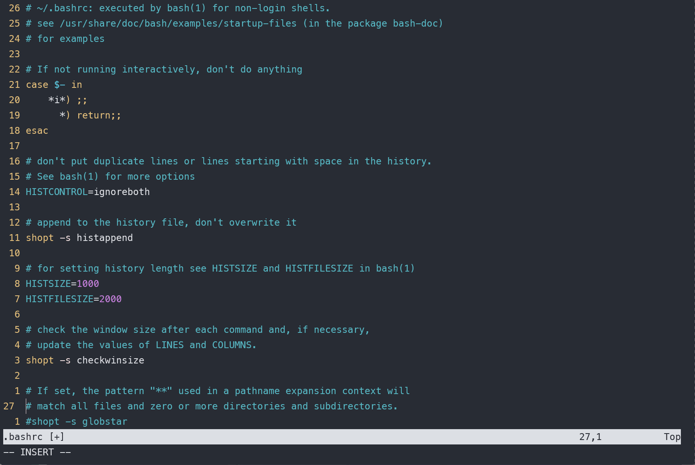
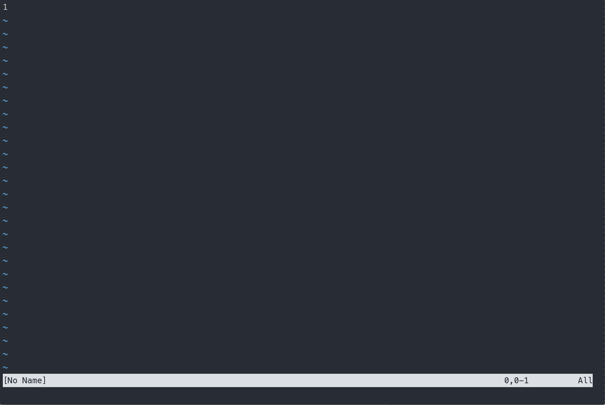
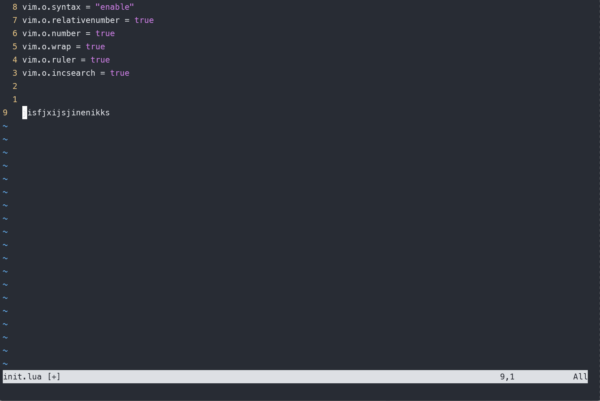
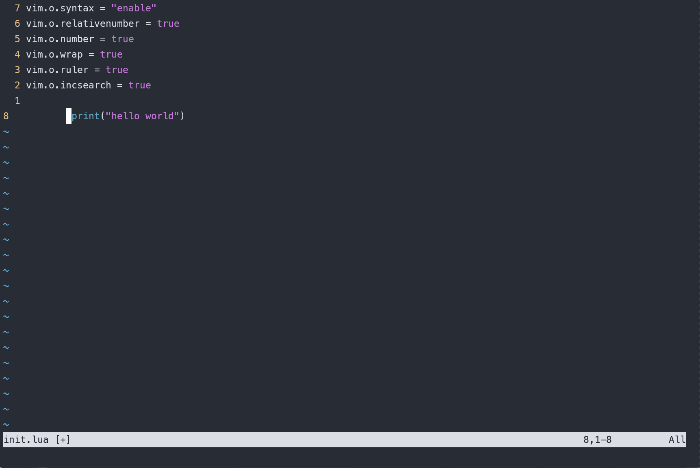
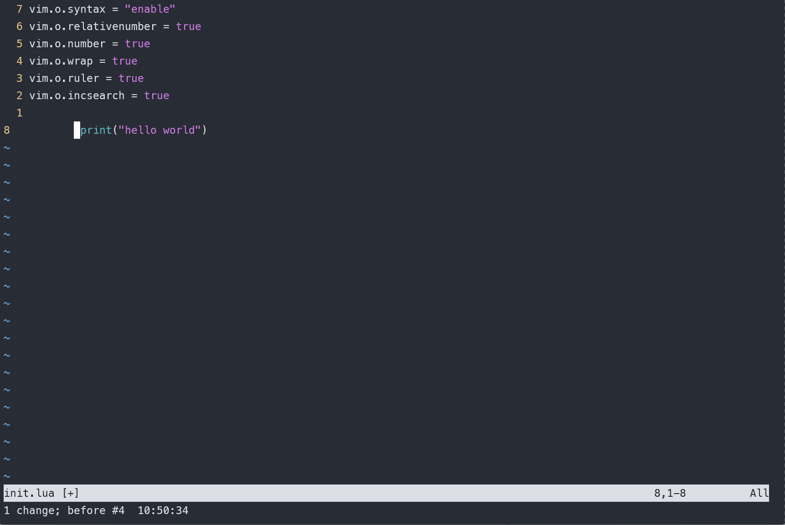

# vim 从嫌弃到依赖(6)——插入模式

插入模式是vim中主要用来处理输入的一种模式，在这种模式中，用户的输入的字符会显示在窗口中。该模式中的行为与在普通编辑器中输入类似。由于在该模式中输入的字符会被当做有效输入，因此该模式下涉及的到命令也少，内容也不多，这一篇文章差不多就能讲完

## 进入插入模式的一些命令

在前面几节我们在介绍一些例子的时候或多或少接触到了如何进入插入模式，特别是用的比较多的 `i`、`c` 等命令。而且还介绍了一些复合命令，有些复合命令同时也肩负着进入插入模式的职责。这里列出一些常用的进入插入模式的方法，也算是对之前的一些命令做一个总结。

| 命令       | 含义                                         |
| ---------- | -------------------------------------------- |
| i          | 在当前光标前进入插入模式                     |
| I          | 在行首进入插入模式                           |
| a          | 在当前光标后面进入插入模式                   |
| A          | 在行尾进入插入模式                           |
| o          | 在下一行进入插入模式                         |
| O          | 在上一行进入插入模式                         |
| s          | 删除当前光标所在字符并进入插入模式           |
| S          | 删除光标所在行并进入模式                     |
| c + motion | 删除指定范围的字符，并进入插入模式           |
| C          | 删除光标所在位置至行尾的字符，并进入插入模式 |

## 在插入模式中删除字符

在插入模式中输入出错，我们一般会退出到普通模式下使用 `c`或者 `d`之类的指令进行删除操作，然后重新进入插入模式，但是有时候这种方式显的有些啰嗦。

其实在插入模式中是可以进行删除操作的，例如如果要删除的字符刚好在光标前面，我们可以使用退格键删除它。另外 `vim`提供了其他几种方式在插入模式中向前删除单词、行

- <Ctrl + h>: 删除光标前一个词(与退格键相同)
- <Ctrl + w>: 删除光标前一个单词
- <Ctrl + u>: 删除至行首

## 插入-普通模式

从插入模式返回到普通模式可以使用 `\<Esc\>` 键，或者使用 `<C-[>`， 但是在某些情况下我主要的经历还是集中在编写代码或者文档上面，之前也说过 `vim` 作为编辑器应该要符合人的一般使用习惯，在文思如泉涌的时候退回到普通模式总有种割裂感，普通模式应该是我们在需要调整思路的时候回去最好。

假设我在写文档或者写代码的时候光标已经到窗口的最后一行了，但是我想将光标定位到窗口中央，一般都会先退回到普通模式，然后使用前面介绍过的 `zz`来完成这一动作，最后再进入插入模式。

针对这种情况 `vim` 提供了一种新的模式 `插入—普通模式`，在插入模式中使用 `Ctrl + o` 来进入该模式。该模式运行用户暂时回到普通模式，然后在执行一条普通模式的命令之后自动回到插入模式中。

例如针对上面的例子，可以使用 `\<Ctrl +o>zz` 来刷新光标位置
&#x20;

<figure><figcaption></figcaption></figure>

## 插入非常用字符

在平时输入的时候，除了常用的英文单词或者汉字之类的字符还有一些非常用字符，例如unicode 图标或者ascii 字符，或者其他键盘无法直接打出的字符。`vim` 支持使用通过字符的二进制编码进行输入

- <Ctrl + v> {code}：按照字符的十进制编码输入，这里code只能输入单字节的字符
- <Ctrl +v>u{code}: 按照字符的16进制编码输入，这里可以支持两个字节的字符输入，例如unicode

例如可以使用该方式输入字符A，A在ascii表的十进制值是65，因此在插入模式下使用 `<Ctrl v>65` 然后回车即可
&#x20;

<figure><figcaption></figcaption></figure>

这里再给出一个输入unicode字符的例子，例如我们输入一个安卓的小机器人，通过查询对应的unicode字码表，它的16进制值是 `e70e`，那么我们就可以输入 `<Ctrl v>ue70e`
&#x20;

<figure><figcaption></figcaption></figure>

除了输入字符表中的例子，也可以输入二合字符。可以使用 `<C-k>{char1}{char2}` 来输入二合字符，例如要输入分数 1/2可以使用 `<C-v>12` 来进行。

这个技巧也是 《vim实用技巧》 书中介绍的，可以在vim中使用 `:h digraph-table` 来查看二合字母表。平时写代码基本用不到这个，所以这里就一笔带过吧。

## 替换模式

vim 中的替换模式与改写模式类似。它会将光标所在字符替换为新输入的字符，按照 vim官方文档的说法，替换模式不会变更文本自身的长度，只会在现有长度上替换已有文本。只有在光标超出原有文本长度时才会表现出插入字符这一特性。而且在替换模式下没有删除的操作。

&#x20;

<figure><figcaption></figcaption></figure>

在某些情况下替换可能会导致代码格式错乱，如果代码中某些位置存在制表符，而制表符的宽度会根据 `tabstop` 的值不同，而显示不同，例如 `vim` 默认的制表符占8个空格，如果我们使用 `R` 进入替换模式，替换tab键的话，原来的tab键所有空白字符都会被替换，这样会导致文本长度发生变化。如果不希望长度变化，vim提供了一种被称之为虚拟替换模式的方式，可以使用 `gR` 进入，这样再替换制表符的话，制表符被替换为一个字符+ 多余的空格，源文本长度不变。

- 使用普通的替换模式

&#x20;

<figure><figcaption></figcaption></figure>

  

- 使用虚拟替换模式

&#x20;

<figure><figcaption></figcaption></figure>

  除了进入和退出替换模式，如果只是想替换一次，可以使用 `r{char}` 和 `gr{char}` 暂时进入替换模式，替换一个字符后立即回到普通模式

替换模式就我自己来说用的还是比较少的，除非我只需要替换个别字符导致的拼写错误。一般我更习惯删除整个单词，然后重新输入。至于虚拟替换模式解决 `tab` 的问题，我更喜欢使用一些配置将 `tab` 键改为空格，这里我们在配置文件中再添加几行

```lua
-- nvim lua 配置
vim.o.softtabstop = 4
vim.o.shiftwidth = 4
vim.o.expandtab = true
```

```vimscript
# vimscript
set softtabstop=4
set shiftwidth = 4
set expandtab = true
```

这几行会将tab替换为4个空格，并且在一些代码中，如果加入了自动缩进的属性，在输入下一行的时候它会自动以4个空格进行缩进

到这里，插入模式下的一些内容都介绍完了，插入模式主要用来做文本输入，与在其他编辑器中输入文本相比并没有太大的区别，所以内容比较少，只需要一篇就结束了。请各位多多支持，订阅专栏，关注作者。方便接收更新推送和日后系统性的回顾，谢谢大家
