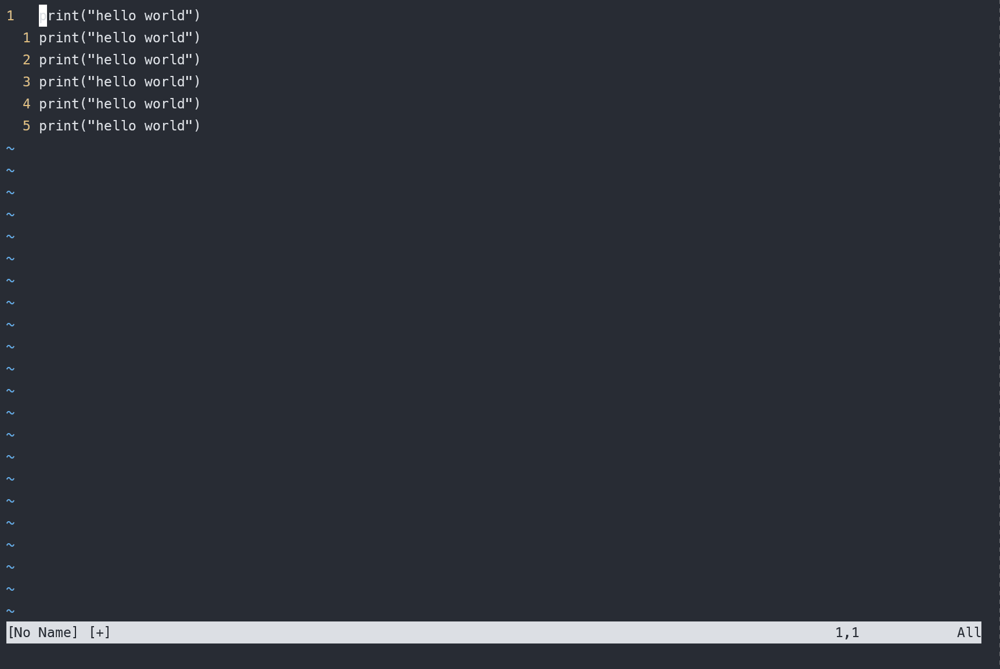

# vim 从嫌弃到依赖(7)——可视模式

`vim` 的可视模式下可以选择一个区域，然后针对区域进行操作。可视模式有点类似于在其他编辑器上使用鼠标选中一块区域然后针对区域进行操作。

vim中有3种可视模式，分别用来处理不同范围的文本：

- 处理字符的可视模式
- 处理行的可视模式
- 处理列块的可视模式

在普通的文本编辑器中，例如在写博客的时候会发现有些地方表述不太正确，这个时候一般会选择先用鼠标选择一句或者一段，然后按退格或者删除键删除所选内容。vim的可视模式也是相同的逻辑，先选区然后对选区进行操作。选区时可以使用之前介绍的 `motion` 来移动光标进行选区，操作选区的时候可以使用 `operator` 进行。

直接说可能有点抽象，下面看一个例子：我们将 `there is one more line` 改为 `there is one line`。

&#x20;

<figure><figcaption></figcaption></figure>

在上述例子中，我们使用 `v` 进入可视模式，在处理字符的可视模式下会在左下方显示 `VISUAL` 字样表示进入了处理字符的可视模式。在该模式中使用 `e` 选中一个单词，然后使用 `d` 删除它

我们发现在可视模式下操作的逻辑与在普通模式下的操作逻辑不太相同，可视模式下先使用 `motion` 移动光标选中部分内容，然后调用 `operator` 来对选中部分做操作。而普通模式下先调用 `operator` 声明需要进行的操作，再使用 `motion` 传入要操作的文本范围。但是可视模式下的操作逻辑确与一般的文本编辑器类似，都是现选中一个部分，然后再针对这部分进行操作。

## 选择模式

在一般的编辑器中，选中一段文本后，输入任意字符会先删除选中部分然后再插入输入的字符，但是vim的可视模式并没有这么做。从上面的例子也可以看出来，vim的可视模式保持了普通模式中使用操作符操作区域的逻辑。但是vim也提供了类似于普通编辑器一样的体验，这个体验就是选择模式。

在可视模式下使用 `<Ctrl +g>` 进入选择模式，下面是一个选择模式的例子

&#x20;

<figure><figcaption></figcaption></figure>

在进入可视模式后，使用 `<Ctrl +g>` 进入选择模式，此时左下角的字样已经变为 `SELECT`，表示此时进入了选择模式。在选择模式中，随便输入一个字符，它会删除选中然后输入对应的内容。

相信能看到这里的小伙伴已经很熟练的使用vim进行文本操作了。这个模式主要是为了迎合那些想让 `vim` 像其他编辑器那样的用户。这种模式效率并不高，而且也不太推荐使用这种模式。

### 可视模式的3种子模式

可视模式下有3种处理不同情况的子模式，分别为：处理字符的可视模式、处理行的可视模式、处理列的可视模式

处理字符的可视模式与普通的 `motion` 配合使用，可以选中光标移动所经过的字符。可以在普通模式下按 `v` 进入

处理行的可视模式可以与行操作的 `motion` 配合，一次选中一行，可以在普通模式下按 `V` 进入

处理列的可视模式可以与一般的 `motion` 配合，一次选中一列，行操作可以选中多列，而 `h l` 则可以选中多列。

3种模式下可以互相转化，按键与上面介绍的相同。例如从处理字符的选择模式切换到处理行的可以使用 `V` ,从处理列的选择模式切换到处理行的，可以使用 `v`。但是如果处在处理字符的可是模式下再次按下 `v` 则会退回到普通模式，在其他模式下类似。

### 重新选择选中区域

如果选择到一半发现我们选择错了该怎么办呢？一种方式是退回到普通模式下，然后再重新进入选择模式。但是在这里要介绍一种新的方式——可以按 `o` 重新选择选区的活动段。选择模式下选区一段固定，另一端可以移动。通过多次按下 `o` 来变更需要移动哪一段

例如下面的例子

&#x20;

<figure><figcaption></figcaption></figure>

## 示例

上面叽里呱啦说了一堆，可能各位小伙伴都没怎么记住，下面给出一些例子，帮助大家来理解之前说到的一些内容

### 示例1：缩进Python代码

假设有这么一段 `Python`代码

```python
def fib(n):
    a , b = 0, 1
    while a < n:
print(a)
a , b = b, a + b
fib(42)
```

要将中间两行缩进两次，变为下面的代码

```python
def fib(n):
    a , b = 0, 1
    while a < n:
        print(a)
        a , b = b, a + b
fib(42)
```

- 解法1： 可以在普通模式下，在对应位置使用 `2>>` 将两行缩进一次，然后使用 `.`命令再重复一次

&#x20;

<figure><figcaption></figcaption></figure>

- 解法2：使用 `>j` 缩进两行，然后使用 `.` 重复，效果与上面的解法1一样，这里就不演示了
- 解法3：使用 `V` 选中一行，然后使用 `2>` 缩进2次，移动到下一行后使用 `.`重复

&#x20;

<figure><figcaption></figcaption></figure>

- 解法4：使用 `V` 选中一行，然后使用 `j` 再选中一行，接着使用 `2>>` 将选中两行一次缩进两次

&#x20;

<figure><figcaption></figcaption></figure>

- 解法5：这里介绍一个在可视模式下的新命令——`gv` 它可以选中上次选中的区域。结合这个命令可以这么操作，先选择两行,再使用 `>` 缩进一次，然后使用 `gv` 选中上次选中的两行，再次使用 `>`

&#x20;

<figure><figcaption></figcaption></figure>

  针对示例1，我给出了5种解法，有利用普通模式加 `.` 命令的方式，也有利用现学的可视模式的解法。当然也有其他的解法，各位小伙伴有好的方式也可以在底下评论。

上面不管哪种解法，大部分都使用了 `.`命令，这里也可以看出 `.` 在处理重复操作时候的威力。虽然它很好用，但是也需要注意：在基于字符的可视模式下 `.` 命令操作的字符数与上次修改中操作的字符数相等。例如

```
world
world1
world11
world111
```

当我们在第一行使用 `v` 进入选择模式，然后使用 `e` 选中一个单词删除它之后，再在下一行执行 `.` 命令的时候，并没有删除一行，只删除了world这个单词

&#x20;

<figure><figcaption></figcaption></figure>

针对示例1给出的几个解法，我们发现使用可视模式在效率上有时候还不如在普通模式下配合 `.` 来使用，这么说是不是说可视模式就失去了它的价值呢？其实也不是，在平时处理文本的操作中，并不是每个任务都需要进行重复，在处理一次性操作的任务时，vim的可视模式在效率上于普通模式其实差距不大，而且有时候要修改的文本所在区域无法准确的通过一两个 `motion` 表达出来，这种情况下可视模式就大大的派上用场了。下面几个列子就可以说明这点。

### 示例2：处理列的可视模式的初步使用

假设我们要将下列代码

```python
Print("hello world")
Print("hello world")
Print("hello world")
Print("hello world")
Print("hello world")
```

变为

```c
print("hello world")
print("hello world")
print("hello world")
print("hello world")
print("hello world")
```

可以使用 `<Ctrl + v>` 进入处理列的可视模式，然后选中所有的 `P`，接着使用 `u` 将其变为小写

&#x20;

<figure><figcaption></figcaption></figure>

### 示例3：添加注释

假设现在有一些Python代码需要添加注释，即将下列代码

```python
print("hello world")
print("hello world")
print("hello world")
print("hello world")
print("hello world")
print("hello world")
```

变为

```python
#print("hello world")
#print("hello world")
#print("hello world")
#print("hello world")
#print("hello world")
#print("hello world")
```

可以使用 `<Ctrl + v>` 进入处理列的可视模式，然后选中所有的 `p`，然后使用 `I` 在行首进入插入模式，接着输入 `#` 注释代码，最后使用 `<Esc>` 退回到普通模式，我们可以看到在插入时它只显示了一行的变化，但是最后回到普通模式后，针对第一行的变化作用到了所有选中行

&#x20;

<figure><figcaption></figcaption></figure>

### 示例3：在每行代码后添加一个分号

还是将之前介绍 `.` 命令的那个例子来作为示例，但是这里提供一个使用列处理的可视模式的方式

在下列代码的每一行行尾添加一个分号

```javascript
var foot = "foot"
var ball = "ball"
var football = foot + ball
```

变为

```javascript
var foot = "foot";
var ball = "ball";
var football = foot + ball;
```

现将光标移动到第一行的最后一列，然后使用 `<Ctrl v>` 进入到处理列的可视模式中，然后移动光标到最后一行的行尾。接着使用 `A` 进入插入模式，输入分号，最后使用 `<Esc>` 回到普通模式。这个时候我们发现vim在被选中区域每一行的尾部都添加了一个分号
&#x20;

<figure><figcaption></figcaption></figure>

在普通模式下 `i I a A` 都有自己的用途，而在处理列的可视模式下我们都只是在用 `I` 和 `A` ，而且他们的含义与在普通模式下有所不同，在处理列的可视模式中，`A` 表示在选择区的每个行尾进行同样的操作，而 `I` 表示在选择区的行首进行同样的操作。至于 `a` 和 `i` 这里则代表要处理的文本对象。

到此我们介绍完了vim中又一个常用的模式，再下一篇中，将介绍vim的另一种常用的模式——命令模式。
