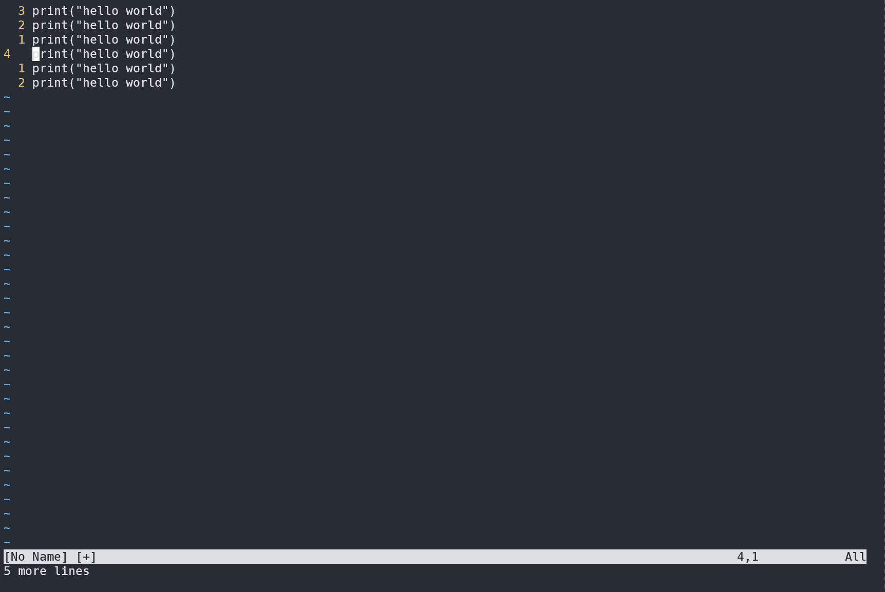
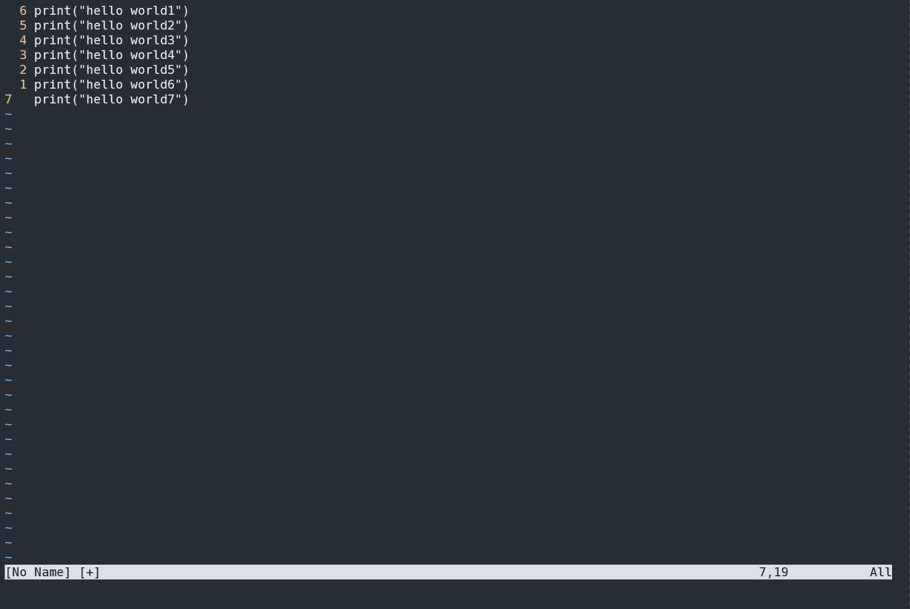
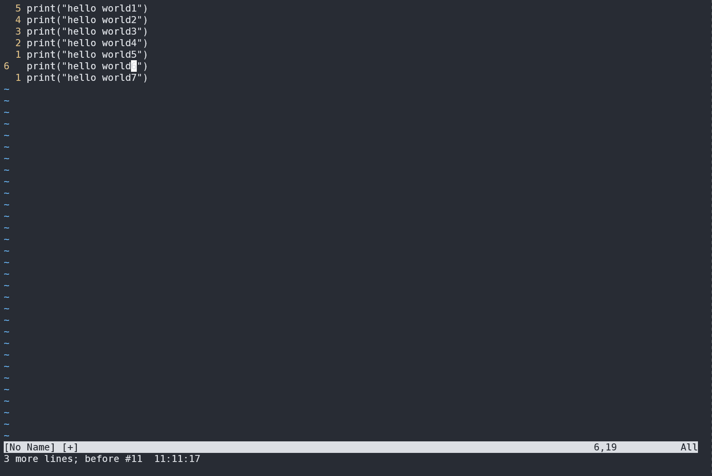
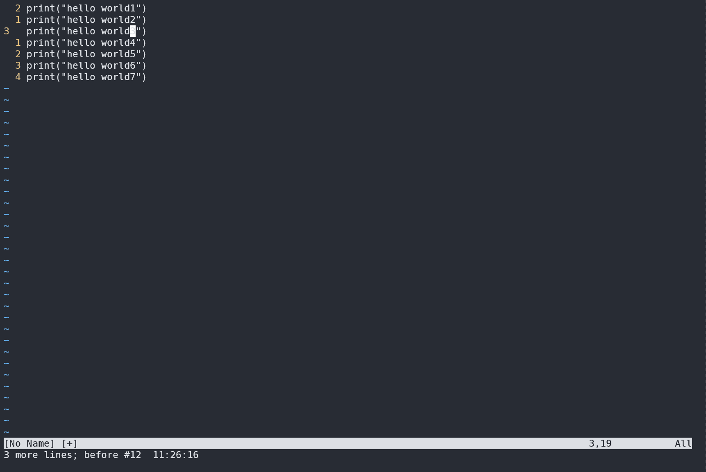
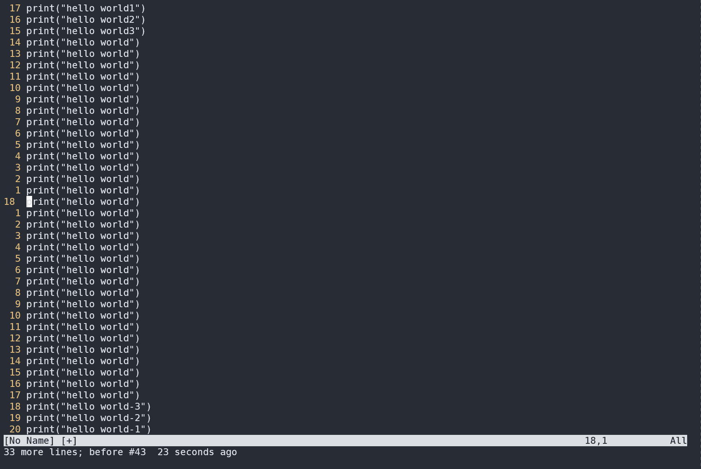
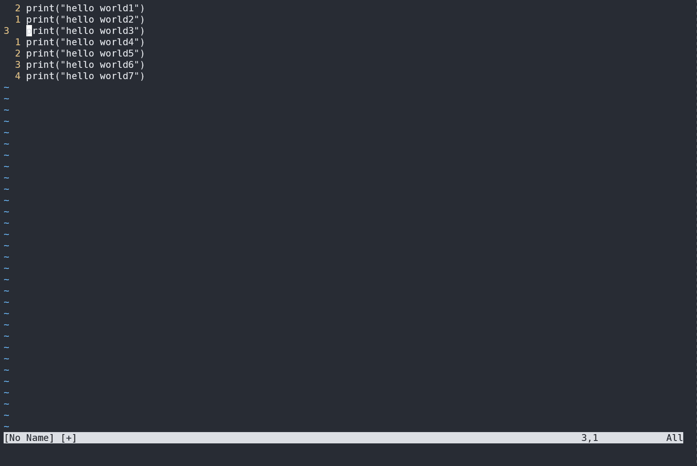
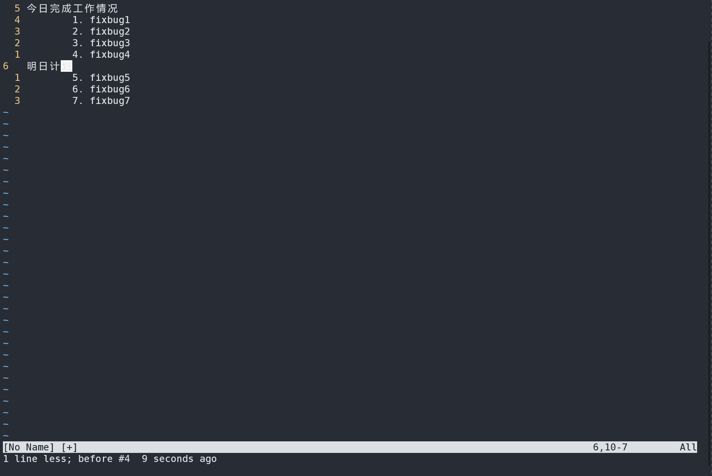
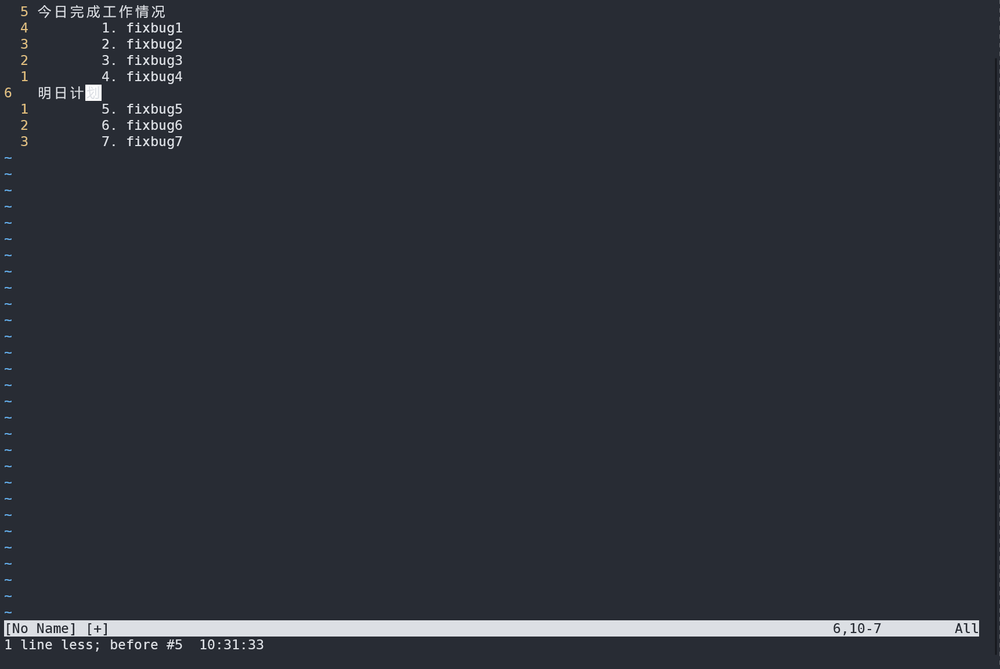
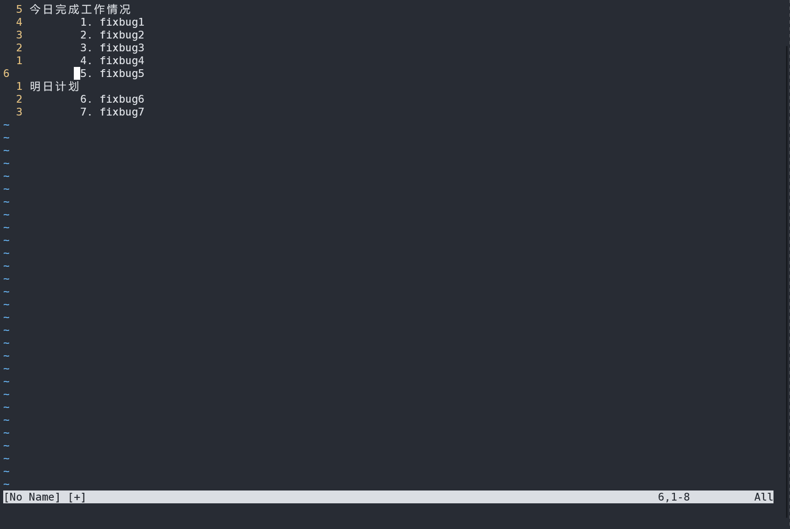

# vim 从嫌弃到依赖(8)——使用命令模式编辑文本

通过前面的文章，我们已经介绍了vim的普通模式、插入模式、可视模式。接下来让我们接着介绍vim中另一个强大的模式——命令行模式

## 命令模式简介

命令模式可以说在vim中的使用频率不亚于普通模式，像我们平时使用 `:w` 将缓冲区的内容写入文件，使用 `:q` 退出vim，这些都是在命令行模式下执行命令。

vim最早是由 `ed` 编辑器发展而来，中间经历过了 `ed` --> `ex` --> `vi` --> `vim` 的流程，vim继承了vi的模式区分以及ex的一些处理文本的命令，这也就是为什么有时候会将vim命令行模式中执行的命令叫做 `ex命令`

在普通模式下，按下 `:` 会切换到命令行模式，这个时候vim会等待我们输入一个命令,最后以回车(\<CR>) 结束输入并执行

在vim 中有许多自带的的命令，而且我们安装第三方插件的时候，插件也会提供一些使用的命令，这里我们主要还是战士如何在命令模式中操作文本。其他相关的命令在后面结合其他功能给出

在命令行中的操作与在插入模式中类似，只是插入模式会将键盘输入写入缓冲区，而命令行模式则会将输入显示在命令行位置。二者的操作符也类似，例如可以适用 `<Ctrl-w>` 和 `<Ctrl-u>`来删除至上个单词的开头和行首。也可是使用 `<Ctrl-v>` 和 `<Ctrl-k>` 来输入键盘上找不到的字符。也可是使用方向键来移动光标，或者使用退格键删除命令。如果中途不想执行输入的命令，可以使用 `<Esc>` 退回到普通模式。

在普通模式下，我们需要使用 `operator +motion` 来操作指定范围的文本，这通常伴随着光标的移动。在命令行模式下，可以操作任意范围内的文本，这表示在某些情况下，使用命令相对于在普通模式下有着更高的效率

我们可以在一个或者多个连续行上执行命令，例如

```python
print("hello world1")
print("hello world2")
print("hello world3")
print("hello world4")
print("hello world5")
print("hello world6")
```

假设光标在第一行的行首位置,我们输入 `:print` ，它会打印当前行。

&#x20;

<figure><figcaption></figcaption></figure>

我们看到执行 `print` 之后会打印光标所在行

## 配合范围使用命令

与普通模式下 `operator` 配合一个 `motion` 来指定操作的文本范围类似，ex命令也可以带有一个范围值来指定操作的范围。这里我们给出一个使用范围的格式格式

```
command = {startpoint},{endpoint} + cmd
```

其中 startpoint 表示开始位置，endpoint表示结束位置，他们中间用 `,`隔开，后面紧跟着一个命令。

如果不加范围，则表示操作的范围是光标所在行，例如 `:print` 表示打印光标所在行的文本

如果只输入一个数字，vim会首先将光标移动到对应的行上，然后针对该行文本执行操作，例如如果输入 `:2print` 它会将光标移动到第二行，然后对第二行文本执行打印操作。

### 使用数字代表对应行

下面再看一个例子：

```python
print("hello world1")
print("hello world2")
print("hello world3")
print("hello world4")
print("hello world5")
print("hello world6")
print("hello world7")
```

我们要删除第三到第5行范围内的文本，就可以输入 `:3,5d`, 其中 `d` 代表 `delete` 是删除的命令

&#x20;

<figure><figcaption></figcaption></figure>

通过上述例子发现，在使用命令模式的时候，不需要在意光标所在位置，如果我们采用普通模式的解法，就需要先使用 `3gg` 跳转到第三行，然后使用 `3dd` 删除三行。或者在第三行使用 `V` 进入可视模式，然后选中3行，接着使用 `d` 删除选中。对比这么几种方式来看，使用命令模式更加的灵活

### 使用特殊符号代表对应行

除了使用数字来代表对应行号所在行外，还是使用一些特殊符号来表达一些特殊含义，例如我们可以使用 `.` 来代表当前光标所在行，所以针对上述操作，我们还有一个解法：使用 `3gg` 跳转到第三行，然后使用 `:.,5d` 删除当前行到第5行的内容

&#x20;

<figure><figcaption></figcaption></figure>

除了使用 `.` 来作为相对行号以外，命令模式中还有其他常用符号，这里列举一些供大家参考:

- `.`:  当前行
- `$`: 文件末尾
- `0`: 虚拟行，位于文件第一行的上方
- `1`: 文件第一行
- `'m`: 包含标记m的行
- `<`: 高亮选区的起始行
- `>`: 高亮选区的结尾行
- `%`: 整个文件，相当于 `:1,$`

介绍了这些操作符之后，如果我们需要删除整个文件，那么有这么几种方法

- 方法1：普通模式下，使用 `0` 跳转到第一行, 然后使用 `dG` 第一行到最后一行的内容
- 方法2: 命令模式下，使用 `:1,$d` 删除第一行到最后一行的内容
- 方法3: 命令模式下，使用 `:%d` 删除所有

&#x20;

<figure><figcaption></figcaption></figure>

### 使用位置偏移量来微调操作范围

在 `{startpoint}, {endpoint}` 中二者均为绝对地址，除了使用绝对地址，我们也可以使用绝对地址+偏移地址的方式来定义操作范围。

可以在绝对地址上使用 `+` 或者 `-` 来定义如何进行偏移，例如 `$-3` 会定位到导数第4行。

假设我有超过1000行的文本，我想保留前3行和后3行，使用命令的时候可以使用 `:4,$-3d`

&#x20;

<figure><figcaption></figcaption></figure>

### 将可视模式的选区作为操作范围

手动指定范围的时候，有时候需要我们去手工数开始行号和结尾行号，数数也算是一个比较累的体力活。除了使用之前的方式外，还可以使用可视模式。将可视模式的选区作为操作区。

我们还是来看上面的删除第一行到第5行的例子，配合可视模式就可以这么做：先使用 `V` 进入可视模式，然后使用 `2j` 选中两行，然后输入 `:d` 进行删除

&#x20;

<figure><figcaption></figcaption></figure>

 我们发现在选中一个选区后，按下 `:` ，在左下角会出现 `<,>` 的字样，根据前面的列表知道 他们代表的是被选中的高亮选区。

## 其他操作文本的命令

在上面的例子中，我们主要使用了 `d` 这个命令来删除文本，除了它还有其他一些处理文本的命令，每个类型的命令接收的参数都各有千秋，但是也很好理解，这里我以 `t` (拷贝粘贴) 和 `m` （移动）为例，希望可以做到抛砖引玉的作用，帮助大家理解其他一些常用的命令。

### 使用 `t` 命令

`t` 命令代表拷贝和粘贴，可以理解为 `CopyTo`。它需要两个参数，一个范围代表拷贝哪个范围的文本，一个位置，代表要将拷贝的内容放置在哪个位置。它的形式如下:

```
:range + t + address
```

第一个 `range` 代表的是范围，要将哪个范围内的文本进行粘贴，第二个 `address` 代表的是一个行号，要将粘贴的内容放置到哪个位置

这里我们给出一个示例来说明如何使用

```
今日完成工作情况
	1. fixbug 1
	2. fixbug2
	3. fixbug3
	4. fixbug4
明日计划
	5. fixbug5
	6. fixbug6
	7. fixbug7
```

假设有这么一个日报，但是我今日工作完成之后发现离下班还有点时间，为了获得内卷达人的称号，我决定先看看明天的 bug5但是又不想为此加班太多，只是简单的看看，然后在工作日报上进行汇报，也就是说我要将 `fixbug5` 复制一份放到今天的任务中。我们可以使用 `:7t5` 来将第7行的内容复制到第5行下方
&#x20;

<figure><figcaption></figcaption></figure>

当然也可以先使用 `7gg` 跳转到第7行，然后使用 `yy` 复制该行，接着使用 `5gg` 跳转到第5行，最后使用 `p` 进行粘贴。对比这种方式使用命令更加简洁，它省略了几次光标跳转的过程。由此看来，在需要大范围操作或者跳转的时候，使用命令会更加简洁也会更加高效

还是以这个日报为例，随着我不要命的卷，终于在今天把bug5给修复了，虽然拉着其他同事陪我加了“一会班”，但是我超额完成了任务，老板承诺的绩效和年终奖马上要到手了，想想就觉得心里美滋滋，我要把明天修复的bug5提前到今天。想到这里我使用 `:7m5` 完成这一操作之后，打卡下班，未来可期
&#x20;

<figure><figcaption></figcaption></figure>

如果再卷点，我能把明天要修复的bug全都在今天修完了，所以我这个时候想在工作日报中把明日计划工作全部移动到今天来，假设当前光标处于 `bug5`的位置，我可以执行 `:.+2,$m.`。至此我带着出任总经理，担任CEO，迎娶白富美，走向人生巅峰的美梦沉沉睡去。

&#x20;

<figure><figcaption></figcaption></figure>

## 总结

到此为止，这篇文章的内容就完了，最后给大家总结一下主要内容

1. 命令模式是vim中又一重要的模式，使用率不亚于普通模式
2. 命令可以配合数字或者其他符号使用，代表将要操作的文本范围
3. 主要以 `t` 和 `m` 命令介绍了操作文本命令的用法

最后再给出一些命令和范围的总结供大家查阅

**文本操作命令**

| 命令                                           | 简写 | 用途                                                      |
| ---------------------------------------------- | ---- | --------------------------------------------------------- |
| :[range]delete [x]                             | d    | 删除指定范围内的行[到寄存器 x 中]                         |
| :[range]yank [x]                               | y    | 复制指定范围的行[到寄存器 x 中]                           |
| :[line]put [x]                                 | pu   | 在指定行后粘贴寄存器 x 中的内容                           |
| :[range]copy {address}                         | t    | 把指定范围内的行拷贝到 {address} 所指定的行之下           |
| :[range]move {address}                         | m    | 把指定范围内的行移动到 {address} 所指定的行之下           |
| :[range]join                                   | j    | 连接指定范围内的行                                        |
| :[range]normal {commands}                      | narm | 对指定范围内的每一行执行普通模式命令 {commands}           |
| :[range]substitute/{pattern}/ {string}/[flags] | s    | 把指定范围内出现{pattern}的地方替换为{string}             |
| :[range]global/{pattern}/[cmd]                 | g    | 对指定范围内匹配{pattern}的所有行，在其上执行Ex 命令{cmd} |

- 有些命令暂时还不知道怎么用，不着急，后面说到对应部分，自然会提到的

**范围符号**

| 符号   | 用途                         |
| ------ | ---------------------------- |
| `.`  | 当前行                       |
| `$`  | 文件末尾                     |
| `0`  | 虚拟行，位于文件第一行的上方 |
| `1`  | 文件第一行                   |
| `'m` | 包含标记m的行                |
| `<`  | 高亮选区的起始行             |
| `>`  | 高亮选区的结尾行             |
| `%`  | 整个文件，相当于 `:1,$`    |
